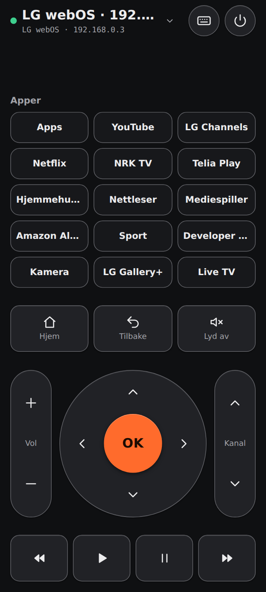
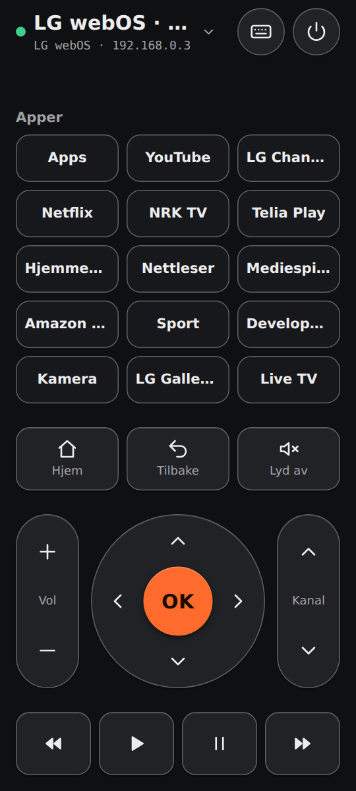
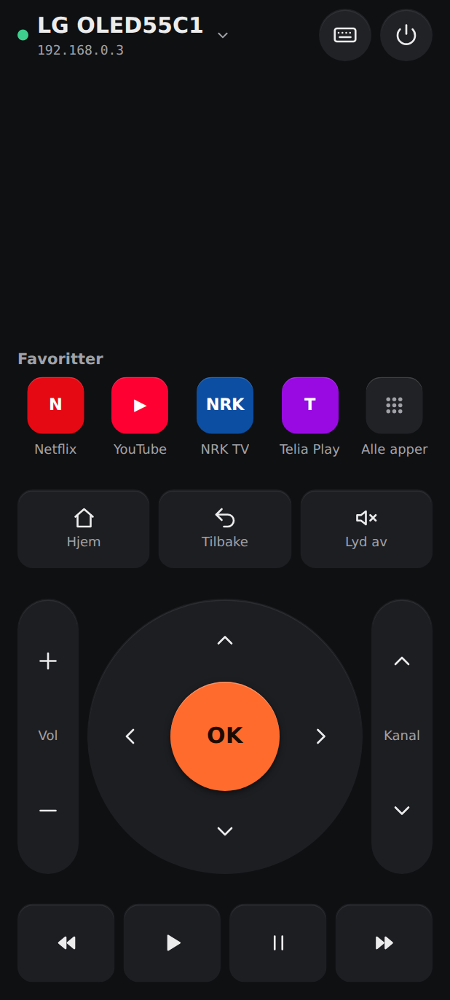
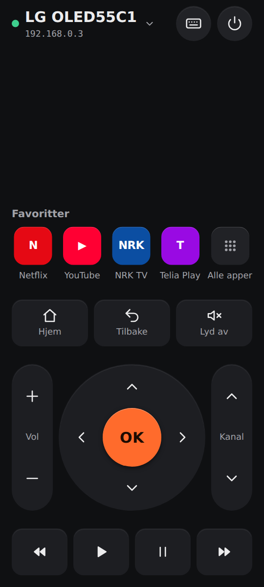
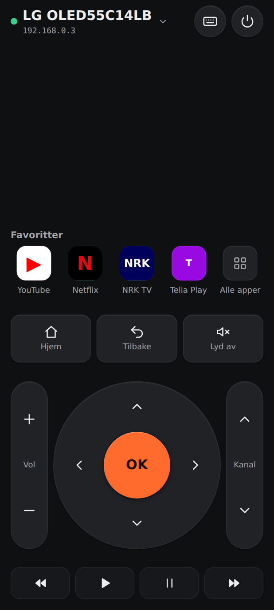
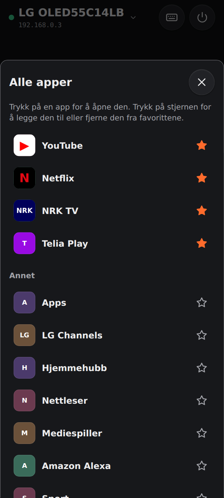
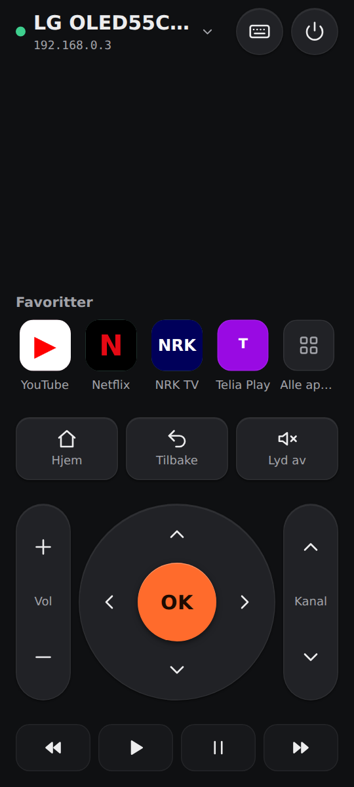

# Revisjon av Fjern – runde 3: design (v2.2)

**Dato:** 2026-09-26 · **Revidert versjon:** 2.2.1 (APK) på brukerens LG webOS-TV
**Utløser:** Appen virker nå mot TV-en, men brukeren savner ikoner på appsnarveiene og må koble til på nytt etter å ha vært ute av appen.
> **Status:** Fase A–D er gjennomført i versjon 2.3.0. Se **[Etter utbedring](#etter-utbedring-v230)**: designskår **69 → 83 / 100**.

**Tidligere revisjoner:** [runde 2](docs/revisjon/REVISJON-v2.md) (79 → 87) · [runde 1](docs/revisjon/REVISJON-v1.md) (47 → 83)

## Metode

ECC-skillsene `design-system` (visuell audit i 10 dimensjoner og «AI slop»-sjekk), `frontend-design-direction` og `make-interfaces-feel-better`. Evidensen er brukerens egne skjermbilder fra telefonen og grensesnittet rendret i Chromium med **den faktiske applisten fra TV-en** (15 apper) på 412×915 og 360×800.

---

## Sammendrag

### Designskår: **69 / 100** (runde 2: 82)

Skåren har falt fordi den ekte applisten avslørte problemer testdataene skjulte. Med 15 apper, der flere er systemapper, tar applisten nesten halve skjermen, navnene kuttes, og det finnes ingen ikoner. I tillegg gjorde de tydelige kantene fra runde 2 at alt får samme visuelle vekt.

| Dimensjon | Runde 2 | Nå | Kort begrunnelse |
| --- | --- | --- | --- |
| Fargekonsistens | 9 | 8 | Tokens holder, men alle flater har samme kant og farge. |
| Typografisk hierarki | 8 | 6 | Appnavn kuttes («Hjemmehu…», «Develop…»). TV-navnet kuttes og står to ganger. |
| Avstandsrytme | 9 | 6 | Tomt bånd mellom topplinjen og «Apper». Applisten presser kontrollene sammen. |
| Komponentkonsistens | 9 | 7 | Appfliser, tastene og transportknappene ser like ut, selv om de har ulik funksjon. |
| Responsivitet | 8 | 6 | Styreknappen krymper til 176 px på 360 px bredde. |
| Mørk modus | 8 | 8 | Uendret. |
| Animasjon | 8 | 8 | Uendret. |
| Tilgjengelighet | 8,5 | 8 | God, men kuttede navn er vanskelige for alle. |
| Informasjonstetthet | 8 | 5 | 15 apper i like fliser, blant dem systemapper som «Developer Mode», «Kamera» og «Hjemmehubb». |
| Polish | 8 | 6 | Ingen appikoner, dobbelt TV-navn, tunge kanter. |
| **Snitt** | **8,2** | **6,9** | |

### Skjermbilder

| Nå, 412×915 | Nå, 360×800 | Forslag, 412×915 | Forslag, 360×800 |
| --- | --- | --- | --- |
|  |  |  |  |

Forslaget er en skisse. Fargede bokstavikoner står i for de ekte ikonene, som hentes fra TV-en.

---

## Funn

### 🟠 Høy

**D1. Appsnarveiene har ingen ikoner.** Brukeren gjenkjenner apper på logoen, ikke navnet. Rene tekstfliser ser også ut som generiske «tags», og det er et svakt AI-mønster.
*Tiltak:* Hent ikonene fra TV-en. LG sender `icon` (URL på TV-en) i `listLaunchPoints`, og Roku har `/query/icon/<id>`. Broen henter og mellomlagrer ikonet, med tak på størrelse og bare fra appens egen TV. Grensesnittet får det fra egen opprinnelse, så CSP-en (`img-src 'self'`) kan beholdes.

**D2. For mange apper, og feil apper, tar for mye plass.** Alle 15 vises i like store fliser, også systemapper. Applisten tar ca. 40 % av høyden og skyver fjernkontrollen sammen.
*Tiltak:* En rad med **favoritter** (4–5 ikoner) rett over kontrollene, og **«Alle apper»** som åpner et ark med hele listen. Favorittene velges automatisk fra kjente strømmeapper (Netflix, YouTube, NRK TV, TV 2 Play, Telia Play, Disney+, Max, Viaplay, Prime Video). Brukeren kan endre dem ved å holde inne en app. Systemapper sorteres nederst i «Alle apper».

**D3. Forbindelsen faller når appen er i bakgrunnen** (UX-funn, rettet i denne runden, se under).

### 🟡 Middels

**D4. TV-navnet vises dobbelt og kuttes.** Topplinjen viser «LG webOS · 192.1…» og under det «LG webOS · 192.168.0.3».
*Tiltak:* Hent det ekte navnet (LG: `system/getSystemInfo` → modell, Roku: `user-device-name`) og vis bare IP-en på linjen under. Gi mulighet til å gi TV-en nytt navn i TV-listen.

**D5. Alle knapper har samme tunge kant.** Kantkontrasten på 3:1 fra runde 2 er lagt på alt. Det gir et «wireframe»-preg der styreknapp, taster, appfliser og transport får samme vekt. WCAG 1.4.11 krever 3:1 bare for visuell informasjon som *trengs* for å identifisere en komponent, og alle knappene her har ikon eller tekst som gjør det.
*Tiltak:* Fjern kantene på fylte knapper og bruk flatefarge og en svak lyskant. Behold 3:1 der formen alene bærer informasjonen, for eksempel valgt TV-type i skjemaet.

**D6. Styreknappen krymper på smale telefoner** (176 px på 360 px). Den er den viktigste kontrollen.
*Tiltak:* Smalere vippebrytere (56 px) og mindre mellomrom gir 200 px på 360 px og opptil 300 px på større telefoner.

**D7. Tomt bånd øverst og ujevn rytme.** Mellomrommet mellom topplinjen og applisten varierer med antall apper.
*Tiltak:* Favorittene står fast rett over kontrollene. Den ledige plassen samles øverst, der tommelen uansett ikke når.

### 🔵 Lav

**D8.** «Apper» som overskrift er vag. «Favoritter» og «Alle apper» forklarer hva du ser.
**D9.** Appnavn i fet 14 px er tungt i et rutenett. 12 px normal vekt under ikonet er mer lesbart og roligere.
**D10.** Transportknappene (⏪ ▶ ⏸ ⏩) og tastene over har samme form. En lavere, mer kompakt transportrad vil skille dem.

### AI-mønstre

Ingen av de ti opprinnelige mønstrene er tilbake. Det eneste nye er tekstbrikkene uten ikon (D1), som minner om generiske «tags».

---

## Rettet i denne runden: forbindelsen faller i bakgrunnen (D3)

**Årsak:** Når appen går i bakgrunnen, fryser Android prosessen og stenger nettverket. TV-en lukker forbindelsen. Appen prøvde å koble til igjen fem ganger i løpet av ca. 30 sekunder, men forsøkene feilet mens appen var i bakgrunnen, og så ga den opp.

**Endring (v2.2.2):**
- Når appen kommer i forgrunnen eller Wi‑Fi kommer tilbake, sjekker broen at LG-forbindelsen svarer (1,5 s). Gjør den ikke det, kobler den til igjen med lagret nøkkel. TV-en spør ikke på nytt.
- Gjenoppkoblingsforsøk stanses i bakgrunnen for å spare batteri.
- Tilstander som krever handling fra brukeren (endret sertifikat, avvist paring, manglende navigasjon), gir ikke nye forespørsler på TV-en av seg selv.

---

## Plan og forventet skår

| Fase | Innhold | Funn | Forventet designskår |
| --- | --- | --- | --- |
| A | Ekte appikoner via broen (LG og Roku), med mellomlagring og tak | D1 | ~76 |
| B | Favoritter over kontrollene, «Alle apper»-ark, hold inne for å endre favoritter, systemapper nederst | D2, D7, D8, D9 | ~83 |
| C | Ekte TV-navn og mulighet til å endre det | D4 | ~85 |
| D | Roligere flater uten tunge kanter, større styreknapp, kompakt transportrad | D5, D6, D10 | ~89 |

---

## Etter utbedring (v2.3.0)

### Designskår: **83 / 100** (før: 69)

| Dimensjon | Før | Etter | Hva ble gjort |
| --- | --- | --- | --- |
| Fargekonsistens | 8 | 9 | Appikonene har egne farger. Resten av grensesnittet er rolig grafitt. |
| Typografisk hierarki | 6 | 8 | Ekte TV-navn (f.eks. «LG OLED55C14LB»), IP-adressen på egen linje, appnavn i 12 px under ikonet. |
| Avstandsrytme | 6 | 7 | Favorittene står fast over kontrollene. Det gjenstår et tomt felt øverst på høye telefoner. |
| Komponentkonsistens | 7 | 9 | Favoritter, taster og avspilling har hver sin form og vekt. |
| Responsivitet | 6 | 8 | Styreknappen er 200 px på 360 px bredde (før 176) og vokser på større telefoner. |
| Mørk modus | 8 | 8 | Uendret. |
| Animasjon | 8 | 8 | Uendret. |
| Tilgjengelighet | 8 | 8,5 | Stjerneknappene har `aria-pressed` og tydelige navn. Knappene har ikon eller tekst, så de trenger ikke kant med 3:1-kontrast (WCAG 1.4.11). |
| Informasjonstetthet | 5 | 9 | Fire favoritter og «Alle apper» i stedet for 15 like fliser. Systemapper står under «Annet». |
| Polish | 6 | 8,5 | Ekte ikoner fra TV-en, fargede forbokstaver som reserve, og du kan gi TV-en eget navn. |
| **Snitt** | **6,9** | **8,3** | |

### Funnstatus

| Funn | Status |
| --- | --- |
| D1 Ingen ikoner | ✅ Broen henter ikonet fra TV-en (LG `largeIcon`/`icon`, med https på port 3001 som reserve, og Roku `/query/icon`). Ikonet godtas bare hvis innholdet er PNG, JPEG, GIF eller WebP, maks 256 KB, og mellomlagres. For LG hentes det bare fra TV-ens egen adresse. |
| D2 For mange apper | ✅ Favoritter velges automatisk fra kjente strømmeapper og kan endres med stjerne i «Alle apper». Systemapper og innganger står under «Annet». |
| D3 Forbindelse i bakgrunnen | ✅ Rettet i 2.2.2. Brukeren har bekreftet at det virker. |
| D4 Dobbelt TV-navn | ✅ Modellnavn fra TV-en (`system/getSystemInfo`), eget navn under TV-er → blyant. Gamle navn som «LG webOS · 192.168.0.3» ryddes automatisk. |
| D5 Tunge kanter | ✅ Fylte knapper har svak kant. Kanten med 3:1-kontrast er beholdt på skjemafelt og valg. |
| D6 Liten styreknapp | ✅ Vippebryterne er 56 px brede, og mellomrommet er mindre. |
| D7 Ujevn rytme | ✅ Favorittene står fast over kontrollene. |
| D8–D10 | ✅ «Favoritter» og «Alle apper», 12 px appnavn, lavere og roligere avspillingsrad. |

### Verifisering

- `npm run verify`: 66/66 tester.
  - Ikonrute: ekte bilde godtas, SVG og HTML avvises, tak på størrelse, ukjente apper og ugyldige id-er avvises.
  - Favoritter testet med brukerens egen appliste.
  - Modellnavn erstatter standardnavn, men ikke brukerens eget.
- `./gradlew testDebugUnitTest assembleRelease`: 13/13, APK 2.3.0.
- Chromium med brukerens appliste og testikoner: favoritter, «Alle apper», stjerner, nytt navn og migrering av navn virker. Ingen konsollfeil, og ingen rulling på 360×800.

### Gjenstår

1. **Ekte LG-ikoner er ikke sett på TV-en ennå.** Adressen og porten til ikonene varierer mellom webOS-versjoner. Mangler et ikon, vises fargede forbokstaver, og feilsøkingsloggen viser årsaken.
2. Det tomme feltet øverst på høye telefoner er bevisst, siden tommelen ikke når dit. Det kan brukes til noe senere, for eksempel «Nå spilles».

| LG med ikoner | Alle apper | 360×800 |
| --- | --- | --- |
|  |  |  |

