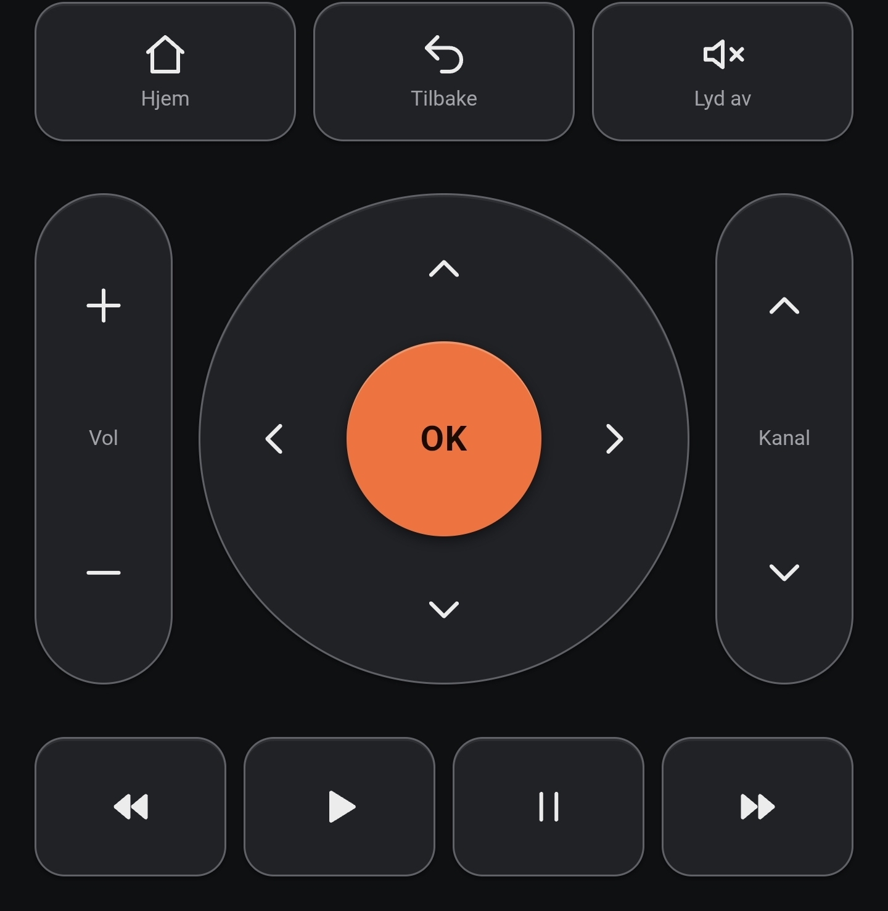
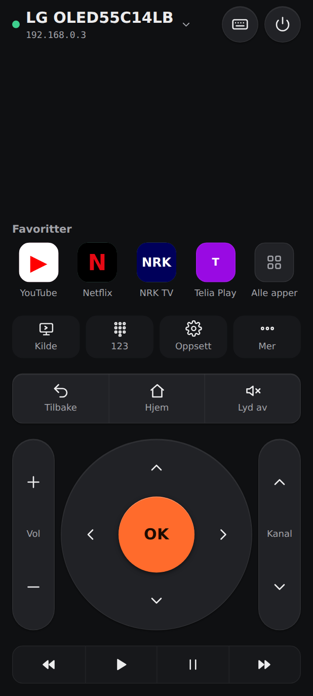
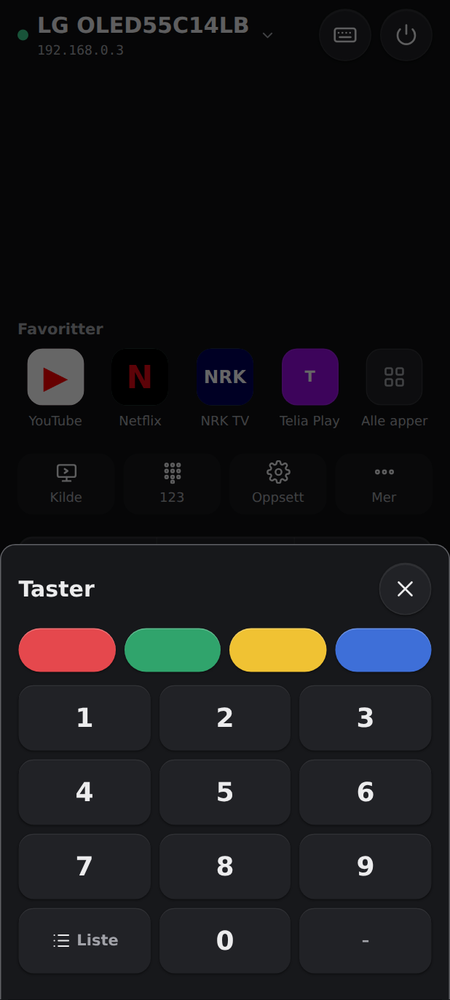
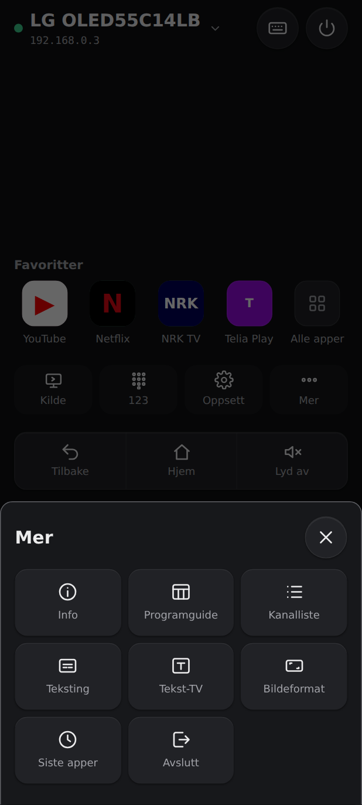
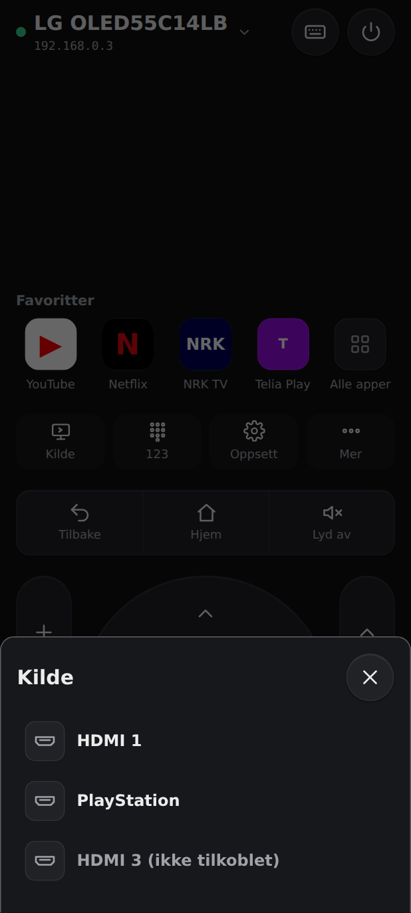
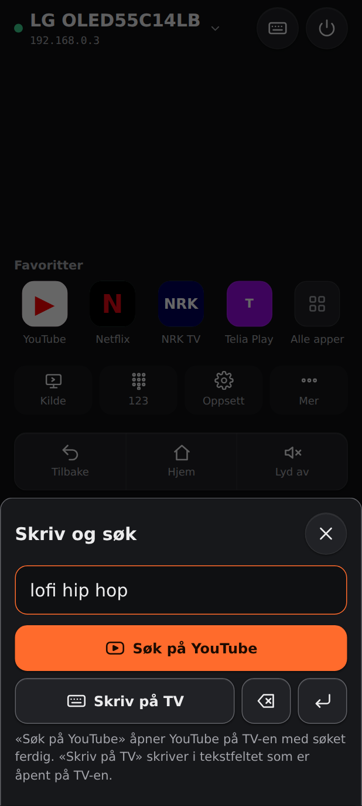
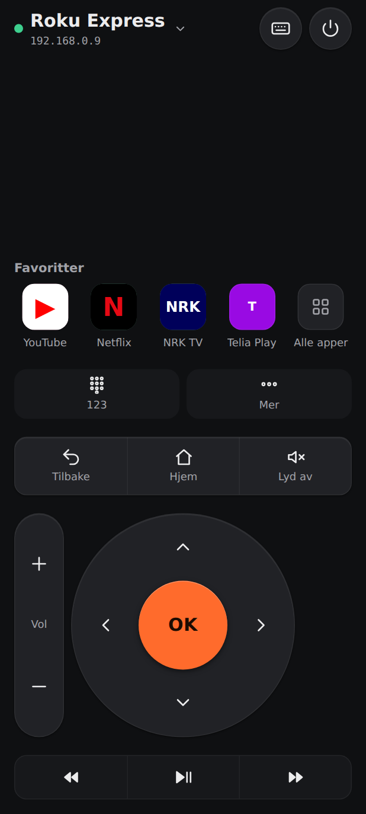
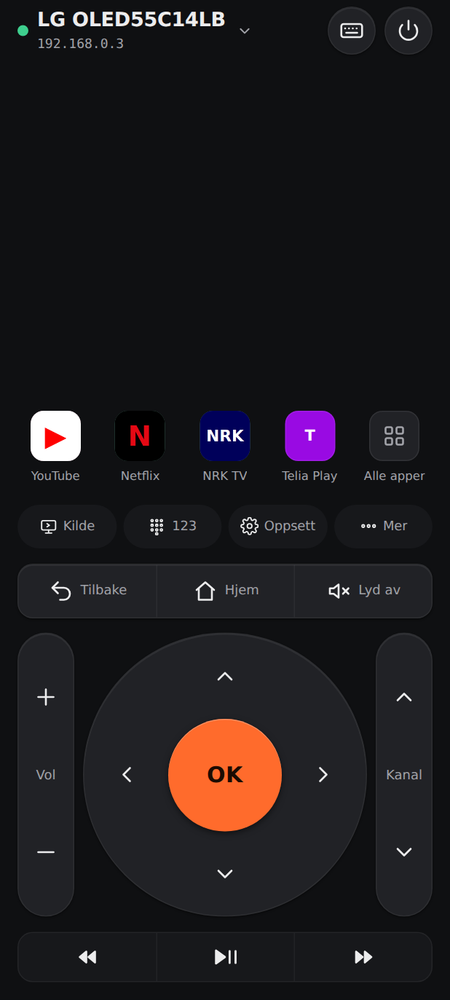
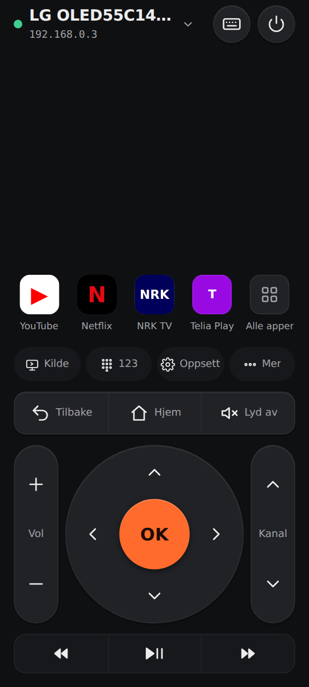

# Revisjon av Fjern – runde 4: full fjernkontroll og visuelt uttrykk (v2.4)

**Dato:** 2026-09-26 · **Revidert versjon:** 2.3.0 på brukerens LG webOS-TV
**Utløser:** Brukeren påpekte at appen ikke er en full fjernkontroll: den mangler talltaster, fargetaster (rød, grønn, gul, blå) og innstillinger, og tastaturet gjør ingenting. Brukeren ber om et profesjonelt, elegant og brukervennlig design.
**Tidligere revisjoner:** [runde 3](docs/revisjon/REVISJON-v3.md) · [runde 2](docs/revisjon/REVISJON-v2.md) · [runde 1](docs/revisjon/REVISJON-v1.md)

> **Status:** Alle funn er utbedret i versjon 2.4.0. Se [Etter utbedring](#etter-utbedring-v240).

## Metode

- ECC `design-system` (10 dimensjoner), `frontend-design-direction` og `make-interfaces-feel-better`.
- En ny dimensjon: **funksjonsdekning**, altså hvor mye av en fysisk LG- eller Roku-fjernkontroll appen dekker.
- LGs komplette liste over knappenavn er hentet fra homebridge-webos-tv (`REMOTE_COMMANDS`). Registrering og YouTube-oppstart er sjekket mot aiowebostv og homebridge-webos-tv.

---

## Før (2.3.0)

### Funksjonsdekning: **55 %**

| Funksjon på fysisk LG-fjernkontroll | 2.3.0 |
| --- | --- |
| Piler, OK, Tilbake, Hjem, volum, kanal, lyd av, av/på | ✅ |
| Avspilling | ✅ |
| Apper | ✅ |
| **Talltaster 0–9, «–», kanalliste** | ❌ |
| **Fargetaster rød, grønn, gul, blå** | ❌ |
| **Innstillinger** | ❌ |
| **Kilde / inngang (HDMI)** | ❌ |
| **Info, programguide, avslutt, teksting, tekst-TV, bildeformat** | ❌ |
| **Søk og tekst** | ⚠️ Tastaturet skrev bare i et felt som allerede var åpent på TV-en, og det var ikke forklart |

### Visuelle funn

| # | Funn | Alvorlighet |
| --- | --- | --- |
| V1 | Mangler halve fjernkontrollen (se over). Brukeren oppfatter appen som uferdig. | 🔴 |
| V2 | Tastaturet «gjør ingenting». LG tar bare imot tekst når skjermtastaturet vises, og appen ga ingen vei til det brukeren faktisk ville: søke på YouTube. | 🟠 |
| V3 | Tilbake, Hjem og Lyd av er tre løse bokser, og avspilling er fire løse bokser. Det ser mer ut som et skjema enn som en fjernkontroll. | 🟡 |
| V4 | Rekkefølgen Hjem–Tilbake–Lyd av er uvant. De fleste fjernkontroller har Tilbake til venstre. | 🔵 |
| V5 | Avspillingsknappene er like store og tunge som navigasjonen, selv om de brukes sjeldnere. | 🔵 |

**Designskår før: 70 / 100** (visuell kvalitet 8,3, men funksjonsdekning 55 % trekker kraftig ned).

---

## Etter utbedring (v2.4.0)

### Funksjonsdekning: **95 %**

| Funksjon | Hvor | LG | Roku |
| --- | --- | --- | --- |
| Talltaster 0–9, «–», kanalliste | **123** | ✅ pekerknapper `0`–`9`, `DASH`, `LIST` | ✅ tall (`Lit_0`–`9`) |
| Fargetaster rød, grønn, gul, blå | **123**, øverst | ✅ `RED` `GREEN` `YELLOW` `BLUE` | – (finnes ikke på Roku) |
| Innstillinger | **Oppsett** | ✅ `MENU` | – |
| Kilde / inngang | **Kilde** | ✅ `tv/getExternalInputList` og `tv/switchInput` | ✅ `tvinput.*` på Roku-TV |
| Info, programguide, kanalliste, teksting, tekst-TV, bildeformat, siste apper, avslutt | **Mer** | ✅ `INFO` `PROGRAM` `LIST` `CC` `TELETEXT` `ASPECT_RATIO` `RECENT` `EXIT` | ✅ Info, Søk, Spol tilbake |
| **Søk på YouTube** | ⌨ **Skriv og søk** | ✅ Starter `youtube.leanback.v4` med søket som `contentTarget` | ✅ ECP `search/browse` med YouTube (837) |
| Skriv i felt på TV, slett, Enter | ⌨ | ✅ IME `insertText`, `deleteCharacters`, `sendEnterKey` | ✅ `Lit_`, `Backspace`, `Enter` |

Knapper TV-en ikke har, skjules automatisk ut fra `capabilities.keys`, som broen sender. Tall- og fargetaster beholder plassen sin, så rutenettet ikke hopper. Det som mangler til 100 %, er taster uten nettverks-API (for eksempel opptak) og musepekeren på LG Magic Remote.

### Visuelle endringer

| Funn | Før | Etter |
| --- | --- | --- |
| V1 | Mangler taster | Snarveisrad: **Kilde · 123 · Oppsett · Mer**. Sjeldne taster ligger i ark, så hovedskjermen er like ren. |
| V2 | Tastaturet gjorde ingenting | **Skriv og søk**: stort felt og primærknappen **Søk på YouTube** (Enter i feltet søker også), i tillegg til «Skriv på TV», slett og Enter. En forklaring står under. |
| V3 | Løse bokser | Sammenhengende **knappegrupper** med skillelinjer (Tilbake · Hjem · Lyd av), slik en fysisk fjernkontroll er bygget. |
| V4 | Hjem først | **Tilbake · Hjem · Lyd av**. |
| V5 | Tung avspilling | Lav, rolig **avspillingslinje** i én gruppe. |

### Skår

| Dimensjon | 2.3.0 | 2.4.0 |
| --- | --- | --- |
| Funksjonsdekning | 5,5 | 9,5 |
| Komponentkonsistens | 9 | 9,5 |
| Informasjonstetthet | 9 | 8,5 (flere taster, men sjeldne ligger i ark) |
| Polish | 8,5 | 9 |
| Brukervennlighet (søk, tekst) | 5 | 9 |
| Øvrige (farge, typografi, rytme, responsivitet, mørk modus, animasjon, tilgjengelighet) | 8,1 | 8,2 |
| **Designskår** | **70** | **88** |

### Verifisering

- `npm run verify`: **71/71**. Nye tester dekker:
  - LG: pekerknapper for tall, farger, guide og innstillinger, Enter via IME.
  - YouTube-søk: `contentTarget` er trygt kodet, så søket ikke kan bryte ut av adressen.
  - Innganger: bare kjente id-er kan velges.
  - Roku: `search/browse` med `provider-id=837`. Roku avviser fargetaster.
  - Capabilities per TV-type.
- `./gradlew testDebugUnitTest assembleRelease`: **15/15**, APK 2.4.0.
- Chromium, 412×915 og 360×800:
  - LG sender `Red`, `Num7`, `Guide`, bytter kilde (`HDMI_2`), søker og åpner `Settings`.
  - Roku skjuler fargetaster, Kilde og Oppsett.
  - Ingen rulling og ingen konsollfeil.

### Gjenstår

1. **YouTube-søket på LG er ikke testet på brukerens TV.** Adressen `https://www.youtube.com/tv#/search?q=…` er YouTubes søkeside for TV. Oppstart med `contentTarget` er bekreftet i homebridge-webos-tv for videoer. Åpner YouTube uten søket, er reserven å skrive med «Skriv på TV» i YouTubes søkefelt.
2. Det tomme feltet øverst på høye telefoner. Kandidat: «Nå spilles» (app og kanal fra TV-en).

| Før (brukerens telefon) | Etter | 123 | Mer | Kilde | Skriv og søk | Roku |
| --- | --- | --- | --- | --- | --- | --- |
|  |  |  |  |  |  |  |

---

## Runde 5 (v2.5.0): kompakt, én spill/pause-knapp og ECC-agenter

**Brukerens ønsker:** én knapp for spill av og pause, en mer kompakt app og ikke noe «AI-design».

### Endringer
- **Én ⏯-knapp:** På LG spør broen TV-en om avspillingsstatus (`com.webos.media/getForegroundAppInfo`) og sender pause eller play etter det. Svarer ikke TV-en, veksler den lokalt. Roku har én play/pause-tast. Mellomrom og `k` på tastatur virker også.
- **Kompakt:** Alt er samlet i én blokk ved tommelen. Snarveier og knappegrupper har ikon og tekst på samme linje (40–48 px). Den synlige «Favoritter»-overskriften er fjernet, fordi ikonene sier det selv. Topplinjen er 56 px, og avspillingslinjen har tre knapper.
- **AI-mønstre** (ECC `design-system`): ingen gradienter, ingen «eyebrows» eller slagord, ingen kort i kort og ingen dekorative piler. Farger brukes bare der de betyr noe: OK, fargetastene og appikonene.

### ECC brukt i denne runden

| ECC | Funn | Tiltak |
| --- | --- | --- |
| `click-path-audit` (skill) | Gikk gjennom alle knapper: favoritter, stjerne, nytt navn, søk, skriv, kilde, strøm, par på nytt, ⏯. Funn: mellomrom på en fokusert knapp ville sendt ⏯ **i tillegg** til knappens egen handling. | Mellomrom og Enter på fokuserte knapper går bare til knappen. |
| `kotlin-reviewer` (agent) | **HIGH:** `catch (e: Throwable/Exception)` og `runCatching` i `suspend`-kode fanget opp `CancellationException`, så coroutines ikke kunne avbrytes (Bridge, LgSession). **MEDIUM:** `!!` i `Validate.device`. | `rethrowCancellation()` i alle catch-blokker. Våre egne `withTimeout` håndteres fortsatt som vanlige tidsavbrudd. Null-sjekk i stedet for `!!`. |
| `silent-failure-hunter` (agent) | Et ikon som ikke kunne hentes, ga 404 i appen uten spor. | Årsaken skrives i feilsøkingsloggen. |

### Verifisering
- `npm run verify`: **73/73**. Nye tester: ⏯ følger TV-ens status (spiller → pause, pauset → play), og veksler lokalt når TV-en ikke svarer. Roku: ⏯ → `Play`.
- `./gradlew testDebugUnitTest assembleRelease`: **15/15**, APK 2.5.0.
- Chromium, 412×915 og 360×800: ingen rulling, ingen kuttede etiketter, ingen konsollfeil.

| 412×915 | 360×800 |
| --- | --- |
|  |  |
