# Revisjon av Fjern – runde 4: full fjernkontroll og visuelt uttrykk (v2.4)

**Dato:** 2026-09-26 · **Revidert versjon:** 2.3.0 på brukerens LG webOS-TV
**Utløser:** Brukeren påpekte at appen ikke er en full fjernkontroll: den mangler talltaster, fargetaster (rød, grønn, gul, blå) og innstillinger, og tastaturet gjør ingenting. Brukeren ber om et profesjonelt, elegant og brukervennlig design.
**Tidligere revisjoner:** [runde 3](docs/revisjon/REVISJON-v3.md) · [runde 2](docs/revisjon/REVISJON-v2.md) · [runde 1](docs/revisjon/REVISJON-v1.md)

> **Status:** Alle funn er utbedret i versjon 2.4.0. Se [Etter utbedring](#etter-utbedring-v240).

## Metode

- ECC `design-system` (10 dimensjoner), `frontend-design-direction` og `make-interfaces-feel-better`.
- En ny dimensjon: **funksjonsdekning**, altså hvor mye av en fysisk LG- eller Roku-fjernkontroll appen dekker.
- LGs komplette liste over knappenavn er hentet fra homebridge-webos-tv (`REMOTE_COMMANDS`). Registrering og YouTube-oppstart er sjekket mot aiowebostv og homebridge-webos-tv.

---

## Før (2.3.0)

### Funksjonsdekning: **55 %**

| Funksjon på fysisk LG-fjernkontroll | 2.3.0 |
| --- | --- |
| Piler, OK, Tilbake, Hjem, volum, kanal, lyd av, av/på | ✅ |
| Avspilling | ✅ |
| Apper | ✅ |
| **Talltaster 0–9, «–», kanalliste** | ❌ |
| **Fargetaster rød, grønn, gul, blå** | ❌ |
| **Innstillinger** | ❌ |
| **Kilde / inngang (HDMI)** | ❌ |
| **Info, programguide, avslutt, teksting, tekst-TV, bildeformat** | ❌ |
| **Søk og tekst** | ⚠️ Tastaturet skrev bare i et felt som allerede var åpent på TV-en, og det var ikke forklart |

### Visuelle funn

| # | Funn | Alvorlighet |
| --- | --- | --- |
| V1 | Mangler halve fjernkontrollen (se over). Brukeren oppfatter appen som uferdig. | 🔴 |
| V2 | Tastaturet «gjør ingenting». LG tar bare imot tekst når skjermtastaturet vises, og appen ga ingen vei til det brukeren faktisk ville: søke på YouTube. | 🟠 |
| V3 | Tilbake, Hjem og Lyd av er tre løse bokser, og avspilling er fire løse bokser. Det ser mer ut som et skjema enn som en fjernkontroll. | 🟡 |
| V4 | Rekkefølgen Hjem–Tilbake–Lyd av er uvant. De fleste fjernkontroller har Tilbake til venstre. | 🔵 |
| V5 | Avspillingsknappene er like store og tunge som navigasjonen, selv om de brukes sjeldnere. | 🔵 |

**Designskår før: 70 / 100** (visuell kvalitet 8,3, men funksjonsdekning 55 % trekker kraftig ned).

---

## Etter utbedring (v2.4.0)

### Funksjonsdekning: **95 %**

| Funksjon | Hvor | LG | Roku |
| --- | --- | --- | --- |
| Talltaster 0–9, «–», kanalliste | **123** | ✅ pekerknapper `0`–`9`, `DASH`, `LIST` | ✅ tall (`Lit_0`–`9`) |
| Fargetaster rød, grønn, gul, blå | **123**, øverst | ✅ `RED` `GREEN` `YELLOW` `BLUE` | – (finnes ikke på Roku) |
| Innstillinger | **Oppsett** | ✅ `MENU` | – |
| Kilde / inngang | **Kilde** | ✅ `tv/getExternalInputList` og `tv/switchInput` | ✅ `tvinput.*` på Roku-TV |
| Info, programguide, kanalliste, teksting, tekst-TV, bildeformat, siste apper, avslutt | **Mer** | ✅ `INFO` `PROGRAM` `LIST` `CC` `TELETEXT` `ASPECT_RATIO` `RECENT` `EXIT` | ✅ Info, Søk, Spol tilbake |
| **Søk på YouTube** | ⌨ **Skriv og søk** | ✅ Starter `youtube.leanback.v4` med søket som `contentTarget` | ✅ ECP `search/browse` med YouTube (837) |
| Skriv i felt på TV, slett, Enter | ⌨ | ✅ IME `insertText`, `deleteCharacters`, `sendEnterKey` | ✅ `Lit_`, `Backspace`, `Enter` |

Knapper TV-en ikke har, skjules automatisk ut fra `capabilities.keys`, som broen sender. Tall- og fargetaster beholder plassen sin, så rutenettet ikke hopper. Det som mangler til 100 %, er taster uten nettverks-API (for eksempel opptak) og musepekeren på LG Magic Remote.

### Visuelle endringer

| Funn | Før | Etter |
| --- | --- | --- |
| V1 | Mangler taster | Snarveisrad: **Kilde · 123 · Oppsett · Mer**. Sjeldne taster ligger i ark, så hovedskjermen er like ren. |
| V2 | Tastaturet gjorde ingenting | **Skriv og søk**: stort felt og primærknappen **Søk på YouTube** (Enter i feltet søker også), i tillegg til «Skriv på TV», slett og Enter. En forklaring står under. |
| V3 | Løse bokser | Sammenhengende **knappegrupper** med skillelinjer (Tilbake · Hjem · Lyd av), slik en fysisk fjernkontroll er bygget. |
| V4 | Hjem først | **Tilbake · Hjem · Lyd av**. |
| V5 | Tung avspilling | Lav, rolig **avspillingslinje** i én gruppe. |

### Skår

| Dimensjon | 2.3.0 | 2.4.0 |
| --- | --- | --- |
| Funksjonsdekning | 5,5 | 9,5 |
| Komponentkonsistens | 9 | 9,5 |
| Informasjonstetthet | 9 | 8,5 (flere taster, men sjeldne ligger i ark) |
| Polish | 8,5 | 9 |
| Brukervennlighet (søk, tekst) | 5 | 9 |
| Øvrige (farge, typografi, rytme, responsivitet, mørk modus, animasjon, tilgjengelighet) | 8,1 | 8,2 |
| **Designskår** | **70** | **88** |

### Verifisering

- `npm run verify`: **71/71**. Nye tester dekker:
  - LG: pekerknapper for tall, farger, guide og innstillinger, Enter via IME.
  - YouTube-søk: `contentTarget` er trygt kodet, så søket ikke kan bryte ut av adressen.
  - Innganger: bare kjente id-er kan velges.
  - Roku: `search/browse` med `provider-id=837`. Roku avviser fargetaster.
  - Capabilities per TV-type.
- `./gradlew testDebugUnitTest assembleRelease`: **15/15**, APK 2.4.0.
- Chromium, 412×915 og 360×800:
  - LG sender `Red`, `Num7`, `Guide`, bytter kilde (`HDMI_2`), søker og åpner `Settings`.
  - Roku skjuler fargetaster, Kilde og Oppsett.
  - Ingen rulling og ingen konsollfeil.

### Gjenstår

1. **YouTube-søket på LG er ikke testet på brukerens TV.** Adressen `https://www.youtube.com/tv#/search?q=…` er YouTubes søkeside for TV. Oppstart med `contentTarget` er bekreftet i homebridge-webos-tv for videoer. Åpner YouTube uten søket, er reserven å skrive med «Skriv på TV» i YouTubes søkefelt.
2. Det tomme feltet øverst på høye telefoner. Kandidat: «Nå spilles» (app og kanal fra TV-en).

| Før (brukerens telefon) | Etter | 123 | Mer | Kilde | Skriv og søk | Roku |
| --- | --- | --- | --- | --- | --- | --- |
|  |  |  |  |  |  |  |

---

## Runde 5 (v2.5.0): kompakt, én spill/pause-knapp og ECC-agenter

**Brukerens ønsker:** én knapp for spill av og pause, en mer kompakt app og ikke noe «AI-design».

### Endringer
- **Én ⏯-knapp:** På LG spør broen TV-en om avspillingsstatus (`com.webos.media/getForegroundAppInfo`) og sender pause eller play etter det. Svarer ikke TV-en, veksler den lokalt. Roku har én play/pause-tast. Mellomrom og `k` på tastatur virker også.
- **Kompakt:** Alt er samlet i én blokk ved tommelen. Snarveier og knappegrupper har ikon og tekst på samme linje (40–48 px). Den synlige «Favoritter»-overskriften er fjernet, fordi ikonene sier det selv. Topplinjen er 56 px, og avspillingslinjen har tre knapper.
- **AI-mønstre** (ECC `design-system`): ingen gradienter, ingen «eyebrows» eller slagord, ingen kort i kort og ingen dekorative piler. Farger brukes bare der de betyr noe: OK, fargetastene og appikonene.

### ECC brukt i denne runden

| ECC | Funn | Tiltak |
| --- | --- | --- |
| `click-path-audit` (skill) | Gikk gjennom alle knapper: favoritter, stjerne, nytt navn, søk, skriv, kilde, strøm, par på nytt, ⏯. Funn: mellomrom på en fokusert knapp ville sendt ⏯ **i tillegg** til knappens egen handling. | Mellomrom og Enter på fokuserte knapper går bare til knappen. |
| `kotlin-reviewer` (agent) | **HIGH:** `catch (e: Throwable/Exception)` og `runCatching` i `suspend`-kode fanget opp `CancellationException`, så coroutines ikke kunne avbrytes (Bridge, LgSession). **MEDIUM:** `!!` i `Validate.device`. | `rethrowCancellation()` i alle catch-blokker. Våre egne `withTimeout` håndteres fortsatt som vanlige tidsavbrudd. Null-sjekk i stedet for `!!`. |
| `silent-failure-hunter` (agent) | Et ikon som ikke kunne hentes, ga 404 i appen uten spor. | Årsaken skrives i feilsøkingsloggen. |

### Verifisering
- `npm run verify`: **73/73**. Nye tester: ⏯ følger TV-ens status (spiller → pause, pauset → play), og veksler lokalt når TV-en ikke svarer. Roku: ⏯ → `Play`.
- `./gradlew testDebugUnitTest assembleRelease`: **15/15**, APK 2.5.0.
- Chromium, 412×915 og 360×800: ingen rulling, ingen kuttede etiketter, ingen konsollfeil.

| 412×915 | 360×800 |
| --- | --- |
|  |  |

---

## Runde 6 (v2.6.0): YouTube-modus som caster

**Brukerens tilbakemelding:** ⏯ virker. «Søk på YouTube» virket ikke. Adressen `youtube.com/tv#/search?q=` åpner ikke søket på LG. Brukeren ønsket YouTube-modusen fra før tilbake: søk på mobilen, se resultatene der, og spill valgt video på TV-en.

### Endringer
- **Søk på mobilen:** Broen leser YouTubes offentlige søkeside (`ytInitialData`) uten API-nøkkel, med tak på sidestørrelse (4 MB) og antall treff (20). Den sender informasjonskapselen `SOCS` for å hoppe over samtykkesiden i EØS. Resultatene har tittel, kanal, lengde («Direkte» for strømmer) og visninger.
- **Miniatyrbilder** leveres gjennom broen (`/api/ytthumb/<id>`). Video-id-en valideres (`^[\w-]{11}$`), og bare ekte bilder godtas. CSP-en `img-src 'self'` er beholdt.
- **Spill på TV-en:**
  - LG: `system.launcher/launch` med `youtube.leanback.v4` og `contentTarget: https://www.youtube.com/tv?v=<id>`, samme metode som homebridge-webos-tv.
  - Roku: `launch/837?contentID=<id>`.
- Det gamle søket (`#/search?q=` og Roku `search/browse`) er fjernet.

### Verifisering
- `npm run verify`: **78/78**. Nye tester dekker tolking av søkesiden (også direkte, ugyldige id-er og tak), hoder og koding av søket, feil uten nett, validering av video-id og avspilling på LG og Roku.
- Kotlin: **15/15**. I tillegg ble Kotlin-tolkingen kjørt mot den ekte YouTube-siden. Den ga de samme 19 treffene som Node.
- Mot ekte YouTube fra broen: søk etter «lofi hip hop» og «nrk nyheter» ga riktige resultater og miniatyrbilder.
- Chromium: søk → 19 treff med bilder → trykk → `ytplay` sendes, arket lukkes, og «Spilles på TV-en» vises.

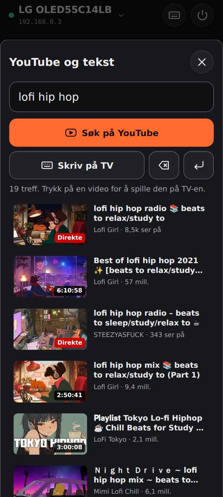

---

## Runde 7 (v2.7.0): YouTube som egen, tydelig funksjon

**Brukerens tilbakemelding:** YouTube-modusen virker veldig bra, men den er gjemt bak tastaturknappen. Andre brukere forstår den ikke.

**Designprinsipp** (ECC `frontend-design-direction`): én knapp skal ha én jobb, og det viktigste skal være synlig uten forklaring. Mønsteret følger fjernkontroll-appene for Google TV og Roku.

| Før | Etter |
| --- | --- |
| YouTube-søket lå bak ⌨, i samme ark som «skriv tekst på TV» | Et **søkefelt «Søk på YouTube»** øverst på forsiden. Det bruker plassen som før sto tom |
| Resultatene i et ark som gled opp | **Eget YouTube-skjermbilde** med tilbakeknapp. Android-tilbakeknappen lukker det |
| Ingen oversikt over hva som spilles | **«Spilles nå»** med miniatyrbilde, tittel, ⏯ og skjul, både på forsiden og i YouTube-visningen |
| – | **Siste søk** som knapper (maks 8, uten duplikater, kan tømmes) |
| – | **🎤 Talesøk:** Android bruker `RecognizerIntent` (nb-NO) uten mikrofontillatelse, siden Google-appen tar lyden. Nettversjonen bruker Chromes talegjenkjenning |
| ⌨ hadde to jobber | ⌨ gjør bare **«Skriv på TV»**, for eksempel passord og Wi‑Fi-navn |
| – | **Engangshint** når YouTube åpnes fra favorittene: «Søk enklere fra mobilen» |

### Verifisering
- `npm run verify`: **79/79**. Ny test for siste søk: rekkefølge, duplikater, tak og ødelagt lagring.
- Kotlin **15/15**, APK 2.7.0. `<queries>` for `RECOGNIZE_SPEECH` er bekreftet i manifestet i APK-en.
- Chromium, 412×915 og 360×800:
  - søkefelt → YouTube → siste søk → resultater → spill → «Spilles nå» → talesøk («nrk nyheter») → tilbake → ⏯ fra forsiden
  - ingen rulling og ingen konsollfeil

| Forside | YouTube | Spilles nå |
| --- | --- | --- |
|  | 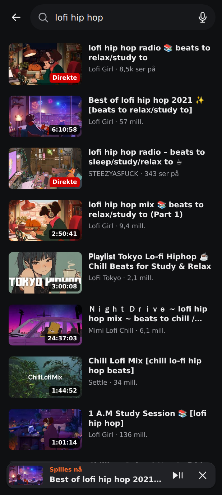 | 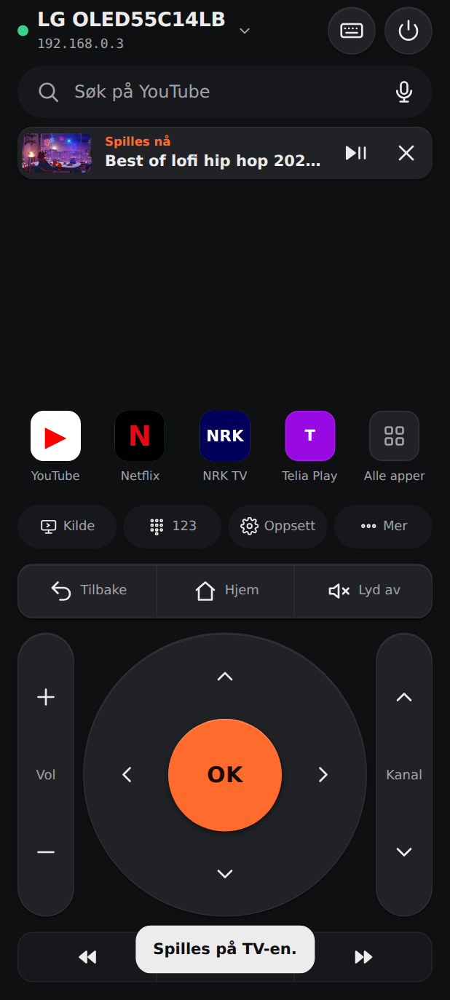 |

---

## Runde 8 (v2.8.0): Designrevisjon – hierarki, trykkflater og finish

**Utløser:** Designrevisjon av `public/` (index.html, style.css, app.js). Skår før: **7 / 10**. Brukeren godkjente planen og ba om at alle forslagene ble bygget.

**Metode:** Designprinsippene fra `frontend-design` / `design-superpowers` (hierarki, tokens, tilstander, trykkflater, rytme, identitet), anvendt manuelt fordi ECC-pluginen ikke var installert i økten. Alt er målt i Chromium med falske API-svar på 320×568, 360×640, 390×844 og 412×915.

### Funn og utbedring

| # | Funn | Alvor | Utbedring |
| --- | --- | --- | --- |
| 1 | Trykk og «sendt»-ramme på styrekorset ble firkanter inne i den runde platen, og rammen gikk over OK | 🔴 | Hver retning er en kakebit (`clip-path`) med treffflate som følger formen. Tilbakemeldingen er en farget bit, ikke en ramme. Tynne diagonaler viser inndelingen |
| 2 | Omtrent 220 px tomrom midt på skjermen | 🟠 | Mellomrom og knapper vokser med skjermhøyden (med tak). **Siste søk** vises som knapper under søkefeltet på høye skjermer. Tomrommet er omtrent halvert, og blokkene henger sammen |
| 3 | Fem like tunge bånd uten hierarki | 🟠 | Tydelig rekkefølge fra lett til tung: verktøylinje uten flate → **styrekors** → Tilbake/Hjem/Lyd av (hevet, flyttet under styrekorset som på en fysisk fjernkontroll) → avspilling (rolig flate) |
| 4 | Trykkflater på 40 px og etiketter på 11 px | 🟠 | Alt er minst 44 px (`--tap`), og alle etiketter er minst 12 px |
| 5 | To kantspråk (`--edge` og tunge `--line`) | 🟡 | `--line` brukes bare for inndatafelt (WCAG 1.4.11). Alt annet bruker `--edge`, `--hairline` og `--bevel` |
| 6 | ⌨ i toppen og «Søk på YouTube» lignet hverandre | 🟡 | «Skriv på TV» er flyttet inn i **Mer**. Toppen har bare TV-valg og strøm |
| 7 | Strøm så ut som en vanlig knapp | 🟡 | Rød tone og egen kant |
| 8 | Kanalpilene var like styrekorsets | 🟡 | Kanal har fylte trekanter (▲▼), og etikettene «VOL» og «CH» står tydeligere |
| 9 | Lite identitet, IP-adresse i toppen, og reserveikonet for YouTube var bare «Y» | 🔵 | Skriften **Manrope** (variabel, lokal, 25 kB, OFL). Toppen viser TV-type i stedet for IP. Reserveikoner har merkefarge og kortnavn (YT, NRK, TV2, D+ …), testet til minst 4,5:1 mot hvit |
| 10 | Ark uten håndtak og uten lukke-animasjon, og aksentfargen var brukt overalt | 🔵 | Arkene har dra-håndtak og kan dras ned, lukkes med trykk utenfor, og glir ned (Escape og Android-tilbake inkludert). Aksenten brukes bare til OK og primærknapper. «Opptatt» er gul, valgt TV og «Spilles nå» er grønne, og fokusringen er hvit |
| 11 | Skjermbildene i manifestet var utdatert | 🔵 | `public/screenshots/` er tatt på nytt fra 2.8.0 |

### Verifisering
- `npm run verify`: **80/80**. Ny test for reserveikoner: kortnavn, merkefarge, TV-ens egen farge vinner, og kontrast på minst 4,5:1 for alle merkene.
- Chromium, automatisert:
  - trykk på → høyre gir en farget bit
  - midten treffer OK
  - arket er fortsatt åpent 40 ms etter lukk (animasjonen) og er lukket etterpå
  - Escape, trykk utenfor, lang dragning og `__fjernBack` lukker. Kort dragning og trykk inne i arket lukker ikke
  - «Skriv på TV» fra Mer bytter ark
  - Siste søk åpner YouTube med søket
  - alt det samme med `prefers-reduced-motion`, da uten animasjon
- Ingen rulling på 320×568, 360×640, 390×844 og 412×915, også med lange søk. Ingen konsollfeil.
- Broen leverer `font/woff2`, og service workeren forhåndslagrer skriften.
- Ikke verifisert: APK-bygg og test på fysisk telefon og TV.

**Skår etter: 8,5 / 10.** Det som gjenstår: Etiketter kuttes på 320 px («Opps…», «Alle ap…»), og tomrommet på høye skjermer er mindre, men finnes fortsatt når det ikke er siste søk eller noe som spilles.

| Før (390×844) | Etter (390×844) | Etter, siste søk (412×915) |
| --- | --- | --- |
| 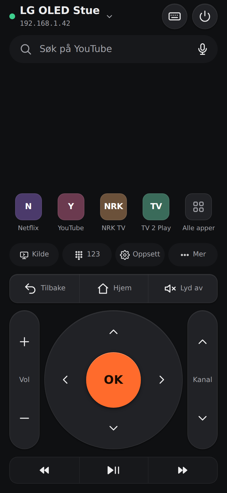 | 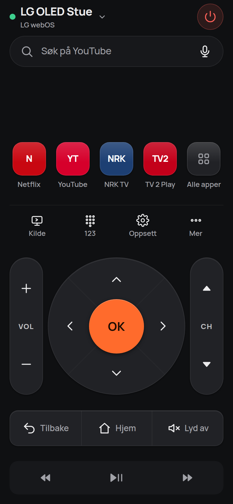 | 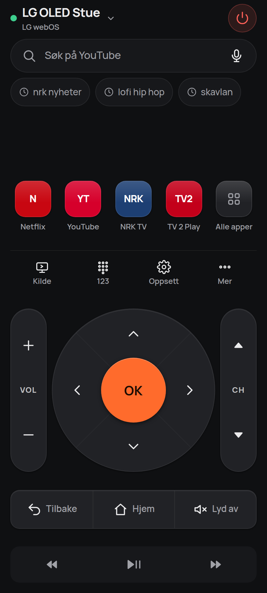 |

| Styrekors før | Styrekors etter |
| --- | --- |
| 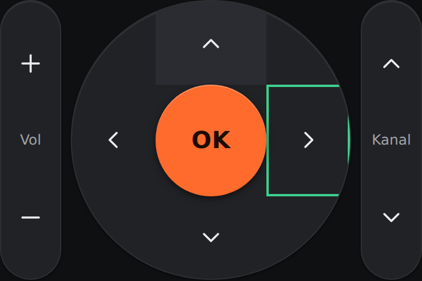 | 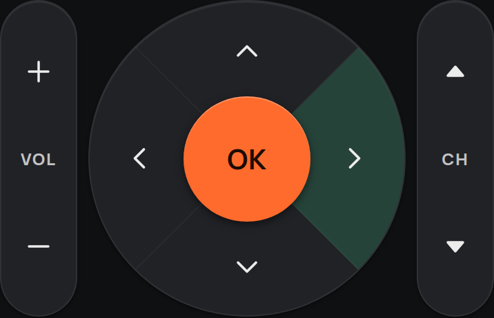 |

| Mer | TV-er | 320×568 |
| --- | --- | --- |
| 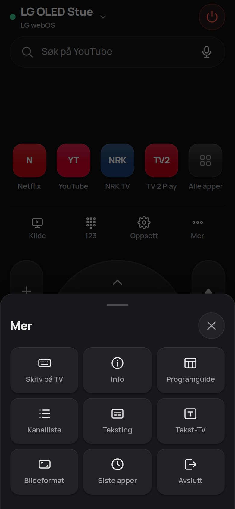 | 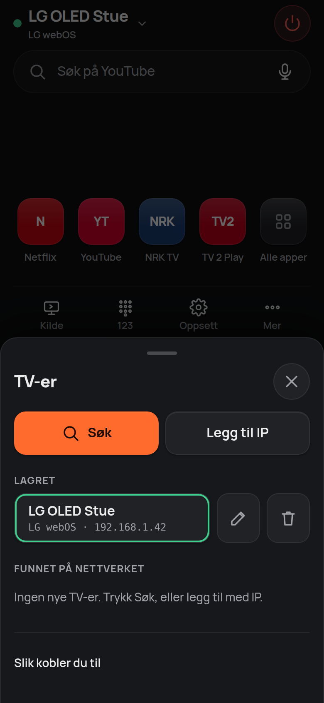 | 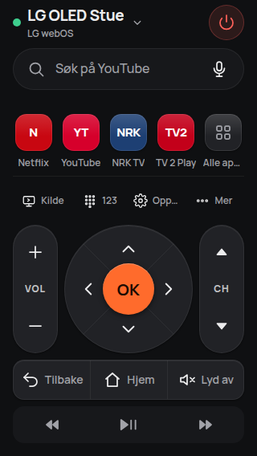 |

---

## Runde 9 (v2.8.1): Fast fjernkontroll uten rulling

**Brukerens tilbakemelding:** Appen virker veldig bra, men forsiden kan rulles opp/ned og sidelengs. Den skal stå fast og være kompakt.

**Årsaker:**
1. Siden hadde bare en minimumshøyde, ikke en fast høyde. Når Android-appen forstørrer teksten etter systemets skriftstørrelse, blir innholdet høyere enn skjermen, og da kan siden rulles.
2. «Siste søk» var en rad som skulle rulles sidelengs.
3. WebView-en viste Androids strekkeffekt når man dro mot kanten.

**Utbedring:**
- `html`, `body` og `.app` er låst til skjermhøyden (`100dvh`, `overflow: hidden`). Bare ark og YouTube-visningen ruller innvendig.
- **Styrekorset tar plassen som er igjen.** Klyngen måler sin egen størrelse med container-enheter (`cqh`/`cqw`), og styrekors og ruller skaleres mellom omtrent 140 og 320 px. Alt får plass på alle skjermer, uten rulling.
- «Siste søk» er én fast rad. Knapper som ikke får plass, skjules i stedet for å rulle sidelengs.
- Android:
  - `overScrollMode = OVER_SCROLL_NEVER` og ingen rullefelt.
  - Tekstzoom følger systemets skriftstørrelse, men med tak på 85–115 %.

### Verifisering
- `npm run verify`: **80/80**.
- Chromium på 320×568, 360×640, 360×740, 390×844, 412×780, 412×915 og 430×932, hver med normal og 115 % tekst:
  - `scrollY`/`scrollX` er 0 etter forsøk på å rulle med hjul
  - dokumentet er ikke høyere enn skjermen
  - nedre kant står alltid 16 px fra bunnen
  - styrekorset er rundt
  - «Siste søk» kan ikke rulles
- Ark og YouTube-resultater ruller fortsatt innvendig. Alle arksjekkene fra runde 8 består.
- Ikke verifisert: på fysisk telefon.

| 390×844 | 360×640 med 115 % tekst |
| --- | --- |
| 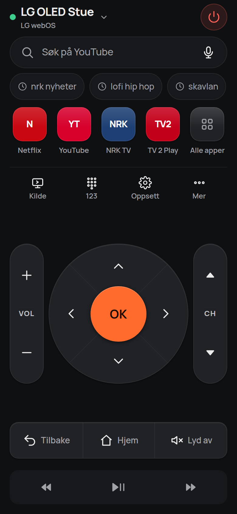 | 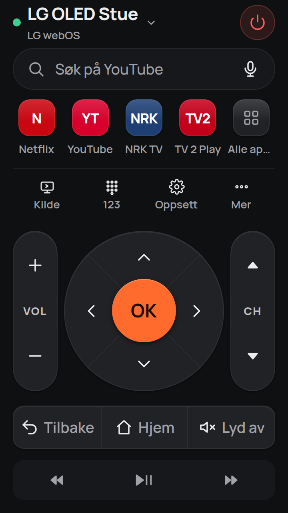 |

---

## Runde 10 (v2.9.0): Samsung-TV-er

**Brukerens tilbakemelding:** Appen fungerer ikke på Samsung-TV-er.

**Årsak:** Appen støttet bare Roku og LG webOS. Samsung ble avvist både i nettverkssøket og under «Legg til med IP».

### Løsning
Samsung Tizen (2016 og nyere) styres med fjernkontroll-API-et over WebSocket. Det er det samme API-et som Samsungs egen SmartThings-app og samsungtvws/Home Assistant bruker. Støtten er bygget likt i Node-broen (`lib/samsung.mjs`) og Android-appen (`Samsung.kt`).

| Funksjon | Hvordan |
| --- | --- |
| Tilkobling | Info fra `http://TV:8001/api/v2/`. TV-er som krever token (de fleste fra 2018) bruker `wss://…:8002` med token, eldre bruker `ws://…:8001` |
| Første gang | TV-en viser «Tillat/Avvis», og appen viser «Trykk «Tillat» på TV-skjermen.». Tokenet og sertifikatavtrykket lagres (trust on first use), og en låst TV nedgraderes aldri til `ws://` |
| Taster | Alle taster på forsiden, under «123» og under «Mer», unntatt «Siste apper», som Samsung ikke har. ⏯ veksler mellom pause og spill |
| Apper | `ed.installedApp.get` / `ed.apps.launch` (dyplenke eller vanlig start etter apptype). Appikonene vises med merkefarge og kortnavn |
| Kilde | Kildemenyen på TV-en og HDMI 1–4 |
| Tekst | `SendInputString` (base64) i feltet som er åpent på TV-en |
| YouTube | DIAL (`POST :8080/ws/apps/YouTube`), med dyplenke til YouTube-appen som reserve |
| Slå på | Wake-on-LAN med MAC-adressen fra TV-ens info. Krever «Slå på med mobil» |
| Søk | SSDP `urn:samsung.com:device:RemoteControlReceiver:1`, bekreftet mot REST-API-et og med TV-ens eget navn. Andre Samsung-enheter (mobiler, lydplanker) ignoreres |
| Par på nytt | Fungerer nå for både LG og Samsung |

### Feil funnet underveis og rettet
1. **WebSocket-klienten (Node) kunne miste den første meldingen.** Samsung sender `ms.channel.connect` med en gang, ofte i samme TCP-pakke som håndtrykket. Klienten leverte den før lytterne var på plass. Den venter nå én hendelsessyklus. Regresjonstesten feiler uten rettingen.
2. **Android: automatisk gjenoppkobling hang for LG** (eksisterende feil). Når forbindelsen falt ut, avbrøt gjenoppkoblingsjobben seg selv, fordi `resetLocked()` avbrøt `reconnectJob`. Appen ble stående på «Forbindelsen falt ut. Kobler til igjen …», også etter «Slå på». Rettet i `Lg.kt` og bygget riktig i `Samsung.kt`. En test mot en falsk LG-TV viste over 10 sekunder uten resultat før rettingen og 1,1 sekunder etter.

### Verifisering
- `npm run verify`: **105/105**. Nye tester:
  - 22 for Samsung-økten (falsk TV)
  - ekte WebSocket der TV-en svarer i samme pakke som håndtrykket
  - Samsung gjennom broen
  - grensesnittlogikken
- Kotlin: kompilert og kjørt på JVM (Android-API-er utenfor). **23/23**:
  - 15 eksisterende tester
  - 6 for Samsung-logikk
  - 2 med ekte OkHttp-WebSocket mot falske TV-er:
    - Samsung: «Tillat», token, taster, tekst, apper, YouTube via DIAL og gjenoppkobling
    - LG: gjenoppkobling
- Chromium: Samsung som valg under «Legg til med IP», og «Mer» uten «Siste apper».
- **Ikke verifisert:** mot en ekte Samsung-TV. Protokollen følger samsungtvws, som er i bred bruk. Hvis noe ikke virker på din modell, send feilsøkingsloggen (*TV-er → Slik kobler du til → Vis feilsøkingslogg*).

---

## Runde 11 (v2.10.0): Android TV og Google TV (Telia-boksen)

**Brukerens ønske:** Styre Telia Play-boksen med Fjern. Boksen er en Android TV-boks, som appen ikke støttet.

### Løsning
Android TV Remote-protokollen versjon 2 er den samme som Google Home-appen og androidtvremote2/Home Assistant bruker. Den er bygget likt i Node-broen (`lib/androidtv.mjs`) og Android-appen (`AndroidTv.kt`), uten nye avhengigheter.

| Del | Hvordan |
| --- | --- |
| Identitet | Appen lager sitt eget klientsertifikat første gang (X.509 v3, RSA 2048, selvsignert, med egen DER-koding i `lib/x509.mjs` og `X509.kt`). Boksen kjenner det igjen etter paring |
| Paring | TLS på port 6467. Boksen viser en sekstegnskode, og appen åpner kodevinduet av seg selv. Koden sjekkes lokalt (første byte av SHA-256 over begge offentlige nøkler) før hemmeligheten sendes |
| Fjernkontroll | TLS på port 6466 med klientsertifikatet. Protobuf-meldinger: konfigurasjon, aktivering, ping, taster (Android KeyEvent), applenker og tekst (IME) |
| Sikkerhet | Boksens sertifikat låses ved første tilkobling. Endres det, stopper appen og ber om ny paring |
| Avvisning | En ukjent eller glemt klient, enten avvist i TLS-håndtrykket eller lukket uten svar (TLS 1.3), starter paring av seg selv |
| Apper | Protokollen har ingen appliste. Appen viser snarveier via applenker. I 2.10.2 ble dette endret til pakkenavn, se nedenfor. YouTube-søk spilles av med `youtube.com/watch`-lenke |
| Søk | mDNS etter `_androidtvremote2._tcp.local` (egen DNS-tolker med komprimering), samtidig med SSDP |
| Grensesnitt | «Android TV» under «Legg til med IP», kodevinduet, og merknaden «Skriv inn kode». «Kilde» er skjult, siden en boks ikke har innganger |

### Verifisering
- `npm run verify`: **125/125**. Nye tester:
  - 19 mot en falsk Android TV over **ekte TLS med klientsertifikat**:
    - paring (riktig og feil kode, avvist hemmelighet)
    - avvisning i håndtrykket og ved lukking
    - tilbakestilt boks som ber om ny kode
    - taster, applenker og tekst med tellere
    - gjenoppkobling og endret sertifikat
  - protobuf, sertifikat og mDNS
  - broens `/api/pair`
- Kotlin: kompilert og kjørt på JVM, **29/29**. Nye tester for protobuf (samme bytes som Node), sertifikat, paringskode, taster og mDNS.
- **Krysstest:** Kotlin-økten mot den falske boksen i Node over ekte TLS (ikke lagt til i repoet). Hele løpet besto: avvist ukjent klient, kode, paret, klar, taster, applenker, tekst og ny tilkobling uten kode.
- Chromium: kodevinduet åpnes av seg selv. Ugyldige tegn filtreres, feil kode gir melding, og riktig kode kobler til.
- **Ikke verifisert:** mot en ekte Telia-boks. Hvis noe ikke virker på din boks, send feilsøkingsloggen.

### Rettet i 2.10.1: «Par» gjorde ingenting i Android-appen
**Brukerens tilbakemelding:** Koden ble skrevet inn, men ingenting skjedde etter trykk på «Par».

**Årsak:** Ruten `pair` manglet i listen over ruter som `NativeBridge` slipper gjennom fra grensesnittet. Appen svarte «Ukjent adresse.», og koden nådde aldri boksen. Nettversjonen (Node-broen) var ikke rammet. Feilmeldingen ble i tillegg skjult, fordi varsler lå under åpne ark, som ligger i nettleserens øverste lag.

**Utbedring:**
- Rutelisten finnes nå bare ett sted (`Bridge.ROUTES`). En ny Kotlin-test leser `public/app.js` og sjekker at alle ruter grensesnittet kaller, er tillatt. Testen feiler uten rettingen («ruten «pair» er ikke tillatt») og består med den.
- Varsler vises som popover i øverste lag, over åpne ark. Det gjaldt alle varsler som ble vist mens et ark var åpent, ikke bare paringen.
- Kodevinduet viser feil rett under feltet, og knappen viser «Sjekker koden …» mens appen venter på svar.
- Feilsøkingsloggen viser om koden ble sendt til boksen, eller avvist lokalt av sjekksummen.

**Verifisert:**
- `npm run verify` består.
- Kotlin 30/30 tester.
- Chromium: feillinjen vises i kodevinduet, og varselet ligger synlig over et åpent ark.

### Rettet i 2.10.2: apper startet ikke på Telia-boksen, og ikonene var bokstaver
**Brukerens tilbakemelding:** Ingen av appene startet når de ble trykket på i Fjern, og ikonene var ikke riktige.

**Årsak:**
- Appene ble åpnet med nettadresser (`https://www.netflix.com/title` og lignende), slik eksemplene for Home Assistant gjør. Det virker på mange Google TV-er. Telia-boksen (Android TV fra operatør) har derimot ingen nettleser. Når ingen app tar imot adressen, skjer ingenting, og boksen gir ingen feilmelding tilbake.
- Funksjonsmasken var fast (622). Den ba om tale og ikke ping, og ble ikke tilpasset det boksen oppgir. androidtvremote2 bruker bare det begge sider støtter.
- Android TV har ingen ikoner å hente, så alle appene fikk bokstavikoner. Telia Play manglet i listen.

**Utbedring:**
- Appene åpnes med pakkenavn, `market://launch?id=<pakke>`. Play-butikken på boksen starter da appen. Dette er samme metode som androidtvremote2 bruker når den får et app-id. Hvert pakkenavn er sjekket mot Google Play (norsk butikk):

  | App | Pakkenavn |
  |---|---|
  | Telia Play | `no.get.play.tv` (TV-versjonen) |
  | NRK TV | `no.nrk.tv` |
  | TV 2 Play | `no.tv2.sumo` |
  | Netflix | `com.netflix.ninja` |
  | YouTube | `com.google.android.youtube.tv` |
  | Disney+ | `com.disney.disneyplus` |
  | HBO Max | `com.wbd.stream` |
  | Prime Video | `com.amazon.amazonvideo.livingroom` |
  | Viaplay | `com.viaplay.android` |
  | Spotify | `com.spotify.tv.android` |
  | Apple TV | `com.apple.atve.androidtv.appletv` |

- Ny funksjonsmaske 615: ping, taster, skjermtastatur, strøm, volum og applenker. Den snittes med det boksen oppgir, både i konfigurasjonen og i aktiveringen.
  - Støtter ikke boksen applenker, får brukeren en tydelig melding i stedet for at ingenting skjer.
  - Feilsøkingsloggen viser:
    - hva boksen støtter
    - hvilken pakke som åpnes
    - hvilken app boksen melder som åpen
- Appenes egne butikkikoner (128 px PNG, 2–17 kB) følger med i `public/icons/apps/`. Grensesnittet godtar bare stier på formen `/icons/apps/<id>.png`. Ingen ikoner hentes fra nettet mens appen kjører.
- Merkefarge for Telia Play i reserveikonet.

**Verifisert:**
- `npm run verify` består. Ny test mot den falske boksen sjekker at:
  - funksjonene snittes (622 gir 614)
  - en boks uten applenker gir meldingen og ingen sendt lenke
  - meldingen om åpen app leses
- Andre tester sjekker at hvert ikon er en ekte 128 px PNG, og at fremmede ikonstier avvises.
- Kotlin: nye tester for pakkenavn, funksjonssnitt og ikonfiler. En test sjekker også at app-listen er lik Node-broens.
- **Ikke verifisert:** mot en ekte Telia-boks. Startes en app fortsatt ikke, viser feilsøkingsloggen hva boksen oppgir at den støtter.

### Rettet i 2.10.3: «Forbindelsen falt ut» når en app ble åpnet, og YouTube-søk mens man skriver
**Brukerens tilbakemelding:** Med 2.10.2 viste appen «Forbindelsen falt ut. Kobler til igjen …» når en app ble trykket på (skjermbilde). Brukeren ønsket også at YouTube-søket skal vise treff fortløpende («live preview»).

**Årsak:**
- Google endret Play-butikken i august 2026, slik at `market://launch?id=<pakke>` ikke lenger åpner apper på mange bokser ([Home Assistant-forumet](https://community.home-assistant.io/t/android-tv-remote-no-longer-launching-apps/1021224), [dokumentasjonen](https://www.home-assistant.io/integrations/androidtv_remote/)). På Telia-boksen fikk lenken forbindelsen til å falle.
- 2.10.2 brukte bare denne lenken.

**Utbedring (apper):**
- Hver app har flere lenker. Appens eget skjema kommer først (`nrktv://`, `netflix://`, `vnd.youtube.launch://`, `spotify://`, `viaplay://deeplink`, `hbomax://deeplink`), så nettadressen, og `market://` sist. Lenkene er hentet fra Home Assistants dokumentasjon og forum.
- Appen sender én lenke om gangen og venter på at boksen melder at appen er åpen (`remote_ime_key_inject.app_info.app_package`).
  - Avviser boksen lenken (`remote_error`), åpnes Play-butikken, eller kommer det ingen melding innen 2,5 s, prøves neste lenke.
  - Faller forbindelsen, venter appen på ny tilkobling. Melder boksen da at appen er åpen, regnes forrige lenke som riktig, ellers prøves neste.
  - Lenken som virket, huskes per boks og app og prøves først neste gang.
  - Virker ingen av lenkene, får brukeren beskjed: «Boksen åpnet ikke …».
  - Melder ikke boksen hvilken app som er åpen, sendes bare den første lenken, siden appen da ikke kan se om den virket.
- `remote_error` logges med hvilket felt boksen avviste, og hvert forsøk logges med grunn.

**Utbedring (YouTube):**
- Forslag til søkeord vises etter 200 ms pause, og treff etter 550 ms. Det sendes ingen kall per tastetrykk, og søket starter fra to tegn.
- Forrige treff står til de nye kommer, så listen ikke blinker. Svar på et utdatert søk forkastes.
- De siste 30 søkene huskes i minnet.
- Enter, et trykk på et forslag eller talesøk gir et vanlig søk, som lagres i «Siste søk». Søk mens man skriver, lagres ikke.
- Forslagene kommer fra Googles forslagstjeneste (`suggestqueries.google.com`, `ds=yt`) via broen, gjennom den nye ruten `ytsuggest` i både Node og Kotlin. Feil gir bare ingen forslag.

**Verifisert:**
- `npm run verify`: **131/131**. Nye tester mot den falske boksen over TLS:
  - lenker prøves til appen meldes åpen, og den som virket, brukes neste gang
  - avvist lenke og frakobling på `market://` gir ny tilkobling og tydelig feil
  - en boks som åpner appen og faller ut samtidig, regnes som åpnet
- Kotlin: **35/35**. Ny live-test med falsk boks over ekte TLS (`AndroidTvLaunchLiveTest`) for de samme tilfellene, og en test av forslagene.
- Chromium:
  - Når «lofi» skrives, kommer forslag og treff uten Enter, med ett kall per pause.
  - Et trykk på et forslag søker og skjuler forslagene.
  - Et tomt felt viser «Siste søk».
- **Ikke verifisert:** mot en ekte Telia-boks. Hvis en app fortsatt ikke åpnes, viser feilsøkingsloggen hver lenke som ble prøvd, og hva boksen svarte.

### Rettet i 2.10.4: TV 2 Play startet ikke, og Fjern lærer appene på boksen
**Brukerens tilbakemelding:** TV 2 Play startet ikke, selv om appen er installert. Brukeren ba om en grundig sjekk, og om at Fjern automatisk skal få vite det den trenger når den kobler til en boks eller TV.

**Funn i gjennomgangen:**
1. **Ingen bekreftelse fra boksen.** Melder ikke boksen hvilken app som er åpen, sendte 2.10.3 bare den første lenken (`https://play.tv2.no` for TV 2 Play) og kunne ikke se at den ikke virket. Det passer med symptomet: appen startet ikke, og det kom ingen feilmelding.
2. **Ingen generell måte å starte en app ut fra pakkenavnet.** `market://` virker ikke lenger, og egne lenker er ikke kjent for alle apper.
3. **App som allerede var åpen.** Fjern kunne prøve flere lenker etter hverandre unødvendig, fordi boksen ikke melder på nytt.
4. **Lenken som virket, ble ikke lagret.** Den lå bare i minnet og ble glemt når appen ble startet på nytt.
5. **Ingen app-informasjon fra boksen.** Fjern visste ikke hvilke apper som er installert.

**Utbedring:**
- **Intent-lenke for alle apper**, foran `market://`: `intent:#Intent;action=MAIN;category=LEANBACK_LAUNCHER;package=<pakke>;…;end`. Den starter TV-appen ut fra pakkenavnet, uten Play-butikken, hvis boksens fjernkontrolltjeneste tolker intent-lenker. Bokser gjør ulikt her. En boks som ikke tolker dem, avviser lenken, og da går Fjern videre til neste.
- **Uten bekreftelse fra boksen:**
  - En avvist lenke eller en frakobling gir neste lenke. Fjern venter bare 1,2 s på en eventuell avvisning.
  - Startet appen likevel ikke, viser varselet **«Prøv en annen måte»**. Den sender neste lenke og lagrer valget.
  - Når alle lenkene er prøvd, får brukeren beskjed.
- **App som allerede er åpen:** Bare den kjente lenken sendes.
- **Lagring per boks:** Lenken som virket, lagres i `data/androidtv-apps.json` (Node) eller `androidtv-apps.json` i appens private lagring (Android). Den overlever omstart.
- **Automatisk læring:** Apper boksen melder at er åpne, læres og vises i «Alle apper», med navnet boksen oppgir, eller et navn laget fra pakkenavnet.
  - Systemapper (startskjerm, innstillinger, oppsett, assistent, Play-butikken) hoppes over.
  - Inntil 40 apper per boks.
  - De åpnes med intent-lenken.
- **Feilsøkingsloggen** viser hver lenke, hvordan det gikk, og lærte apper.

**Om «automatisk informasjon ved tilkobling»:**
- **LG, Samsung og Roku:** TV-en gir applisten og ikonene ved tilkobling. Det gjorde Fjern allerede.
- **Android TV / Google TV:** Fjernkontrollprotokollen har verken en appliste eller en «start app»-kommando. Det gjelder også Googles egen fjernkontroll-app.
  - Fjern lærer derfor appene etter hvert som boksen melder dem, og husker hvilken lenke som virker.
  - Å prøve alle appene automatisk ved tilkobling er ikke gjort med vilje: det ville åpnet den ene appen etter den andre på TV-en.

**Verifisert:**
- `npm run verify` består. Nye tester mot den falske boksen over TLS:
  - boks uten meldinger om åpen app (avvisning gir neste lenke, «Prøv en annen måte», lagring, ny økt bruker lagret lenke)
  - app som allerede er åpen
  - lærte apper og systemapper
- Kotlin: **38/38**, kjørt tre ganger på rad. Nye live-tester over ekte TLS for de samme tilfellene, og lagring i fil.
- **Ende-til-ende i Chromium** med den ekte Node-broen og en falsk boks over TLS, i to varianter:
  - **Boksen melder ikke åpen app:** tilkobling og taster (19, 23, 3). TV 2 Play: `https://` ble avvist, intent-lenken ble sendt, og varselet viste «Prøv en annen måte». Et trykk på den sendte `market://`. Boksen koblet fra, Fjern koblet til igjen og ga en tydelig feilmelding.
  - **Boksen melder åpen app:** TV 2 Play ble bekreftet åpen via intent-lenken. En app åpnet på boksen ble lært og vist i «Alle apper».
  - **YouTube** mot ekte nett: forslag og 17–18 treff uten Enter.
  - Ingen JS-feil.
- **Ikke verifisert:** mot en ekte Telia-boks. Om boksen tolker intent-lenker, vet vi først når den prøves. Feilsøkingsloggen viser hver lenke og hva boksen svarte.

### 2.11.0: nytt, kompakt design for Android-telefoner (Samsung Galaxy)
**Brukerens ønske:** Et helt nytt, elegant og brukervennlig design som er kompakt på Android-telefoner som Samsung Galaxy.

**Problemer med forrige design (fra brukerens skjermbilde):**
- Kontrollene lå som fire løse blokker med ulik form: verktøylinje uten flate, volum og kanal på hver side, menyrad og avspillingsrad. Det ga uro og et tomt felt midt på.
- Styrekorset ble begrenset av bredden, fordi volum og kanal sto ved siden av. Det ble lite (182 px) på en Galaxy S.
- Den oransje aksenten og den store strømknappen konkurrerte med innholdet.

**Nytt design (inspirert av Samsung One UI og Googles TV-fjernkontroll):**
- **Ett kontrollkort** med styrekorset i full bredde. Under det kommer Tilbake, Hjem og Lyd av, deretter vannrette vippeknapper for volum og kanal (− VOL + og ▼ CH ▲), og til slutt avspilling med ⏯ i midten.
- **Snarveiene nederst** (Kilde, 123, Oppsett, Mer), som navigasjonslinjen i One UI.
- **Søk, apper og kontroller samlet nederst** ved tommelen. Ledig høyde havner under topplinjen.
- **Rolig palett** med én blå aksent. OK har hvit tekst med kontrast 4,7:1. Strømknappen er mindre, og søkefeltet er tynnere.
- **Tilpasset størrelse:**
  - Styrekorset har fast mål ut fra kortets bredde (container-enheter) og skjermhøyden.
  - Kortet følger innholdet, så det blir ikke tomrom i det.
  - I smale kort (320 px) vises bare ikonene på Tilbake, Hjem og Lyd av. Teksten beholdes for skjermlesere.
  - Når en TV ikke har kanaler, fyller volum hele raden.

**Verifisert (Chromium, skjermbilder):**

| Skjerm | Mål | Styrekors |
|---|---|---|
| Galaxy S | 360×732 | 244 px (før: 182 px) |
| Galaxy S Plus | 384×784 | 272 px |
| Galaxy A | 412×868 | 272 px |
| Liten | 360×640 | 152 px |
| Minst | 320×568 | 140 px |

- Ingen rulling, og ingenting havner utenfor skjermen.
- Alle knapper er minst 40 px.
- «Mer», talltastene og YouTube er sjekket med de nye fargene.
- `npm run verify` 134/134 og Kotlin 38/38.
- Ende-til-ende-testen mot den falske boksen besto med det nye oppsettet: taster, apper, «Prøv en annen måte» og YouTube.
