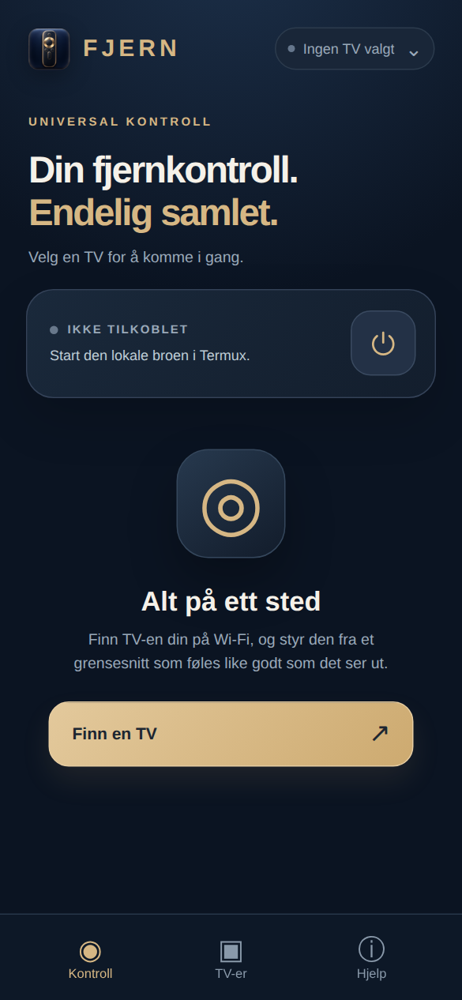
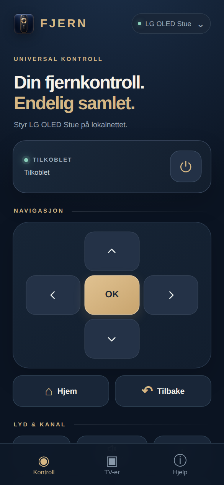
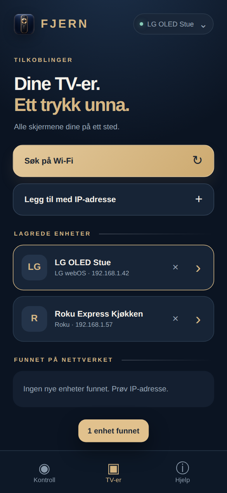
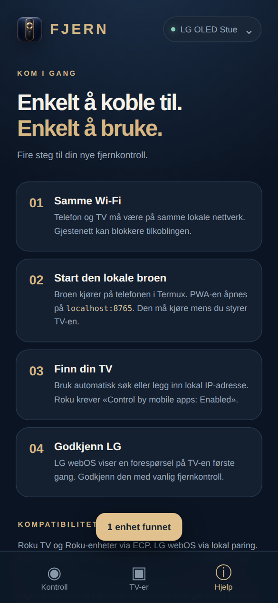
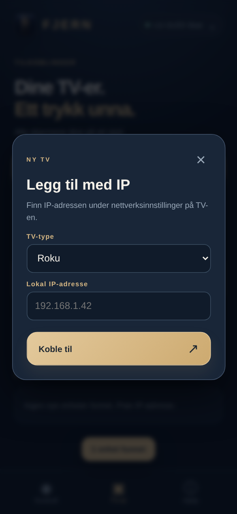
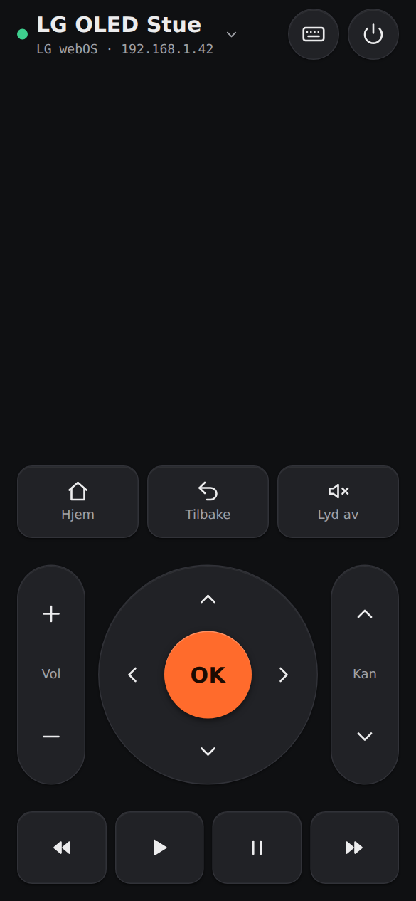
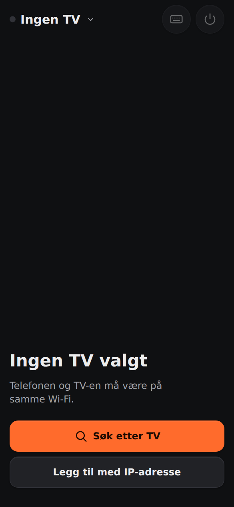
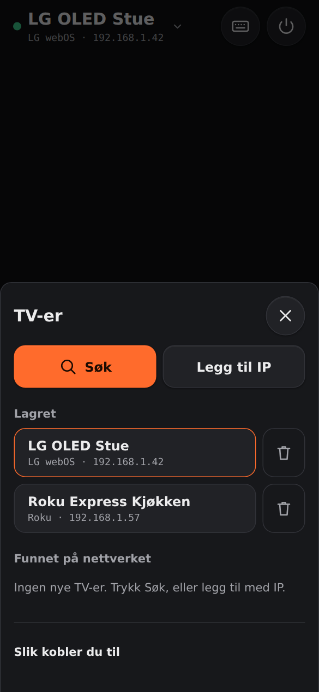
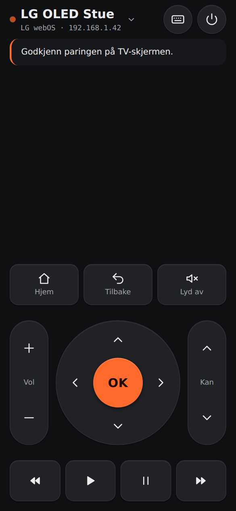
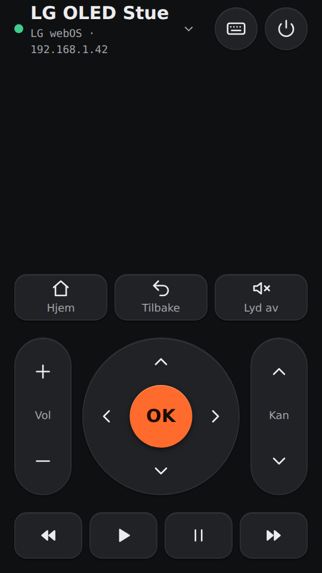

# Revisjon av Fjern PWA

**Dato:** 2026-09-26 · **Versjon:** 2 (full revisjon, design + teknikk)
**Omfang:** Hele repoet: `server.mjs`, `app.js`, `sw.js`, `index.html`, `style.css`, `manifest.webmanifest`, `README.md`, `icons/`
**Mål:** Gjøre design, brukeropplevelse og teknikk optimalt, og **fjerne det generiske «AI-laget»-uttrykket**.

> **Status:** Alle forslag er gjennomført i versjon 2.0.0. Del A–D beskriver tilstanden **før** utbedring (filreferanser gjelder den gamle koden). **[Del E](#del-e--etter-utbedring-v200)** viser resultatet og ny skår: **47 → 83 / 100**.

## Metode

Gjennomgangen følger sjekklistene i pluginen [everything-claude-code](https://github.com/affaan-m/everything-claude-code) (ECC v2.2.2, installert med prosjektomfang i `.claude/settings.json`):

| ECC-skill | Brukt til |
| --- | --- |
| `design-system` (visuell audit + «AI slop detection») | 10 designdimensjoner og sjekk av typiske AI-mønstre |
| `frontend-design-direction` | Retning, hierarki og anti-mønstre for verktøy-UI |
| `make-interfaces-feel-better` | Radius, bevegelse, trykkflater, typografiske detaljer |
| `production-audit` | Klar-for-bruk-score og driftsrisiko |
| `security-review`, `error-handling` | Sikkerhet, validering og feilmeldinger |
| `frontend-a11y` | Semantikk, ARIA, tastatur og fokus |
| `verification-loop` | Funn er verifisert mot kjørende kode, ikke bare lest |

**Evidens:** Broen ble kjørt lokalt (Node 22) og API-et testet med `curl`. Grensesnittet ble rendret i Chromium på 390×844 (vanlig telefon) med mocket API, og elementposisjoner ble målt. CSS-en ble analysert for farger, radius og skriftstørrelser. Skjermbilder ligger i [`docs/revisjon/`]().

---

## Sammendrag og skår

### Totalskår: **47 / 100**

| # | Område | Vekt | Skår | Kort begrunnelse |
| --- | --- | --- | --- | --- |
| 1 | Funksjon og korrekthet | 15 % | 4 / 10 | Starter ikke fra repoet (K1). Roku spol/pause virker ikke (H1). |
| 2 | Sikkerhet | 10 % | 7,5 / 10 | Solid lokal modell. Mangler CSP, `.gitignore` for nøkler. |
| 3 | Robusthet og feilhåndtering | 10 % | 4,5 / 10 | Krasj ved nettverksfeil, engelske feilmeldinger, ingen LG-timeout. |
| 4 | Visuell kvalitet og konsistens | 15 % | 5 / 10 | Pent ved første øyekast, men 62 farger, 9 radier og 17 skriftstørrelser. |
| 5 | Egenart (fravær av AI-preg) | 10 % | 3 / 10 | Nesten alle kjente AI-mønstre er til stede, se del A2. |
| 6 | UX og informasjonsarkitektur | 15 % | 5 / 10 | Fjernkontrollen er skjøvet under en reklameoverskrift. Volum havner bak menyen. |
| 7 | Tilgjengelighet | 5 % | 6 / 10 | God fokusring og `reduced-motion`. Symboler leses opp, små tekster. |
| 8 | PWA og ytelse | 5 % | 6,5 / 10 | Lett og uten avhengigheter. Poller i bakgrunnen, manifest kan forbedres. |
| 9 | Kodekvalitet og vedlikehold | 5 % | 4 / 10 | Håndminifisert kode, ingen struktur for design-tokens. |
| 10 | Test, CI og dokumentasjon | 10 % | 2,5 / 10 | Ingen tester eller CI. README beskriver filer som ikke finnes. |

**Production audit (ECC): 40/100, blokkert.** Appen kan ikke startes fra en ren checkout, og broen kan krasje ved nettverksfeil.

**Forventet skår etter tiltakene** (se del D): cirka 65 etter fase 1–2, cirka 80 etter redesign i fase 3, og 85–90 når tester, CI og test på ekte TV er på plass.

---

## Del A – Design og «AI-preg»

### A1. Visuell audit (ECC `design-system`, 10 dimensjoner)

| Dimensjon | Skår | Evidens | Tiltak |
| --- | --- | --- | --- |
| Fargekonsistens | 3/10 | **62 unike hex-farger** i `style.css`, men bare 9 tokens i `:root`. Nesten hver komponent har egne blågrå nyanser (`#172436`, `#192638`, `#1a293b`, `#1b293a` …). | Maks 10–12 tokens. Ingen rå hex utenfor `:root`. |
| Typografisk hierarki | 5/10 | **17 ulike skriftstørrelser** (10–63 px). Inter er oppgitt, men lastes ikke. Det faller tilbake til systemfont, så designet ser annerledes ut enn tenkt. | Typeskala med 5–6 trinn. Velg én font bevisst og selvhost den, eller bruk systemfonten ærlig. |
| Avstandsrytme | 4/10 | Vilkårlige verdier: 7, 9, 13, 17, 19, 23, 26, 38 px. | Skala på 4 px: 4, 8, 12, 16, 24, 32, 48. |
| Komponentkonsistens | 5/10 | **9 ulike border-radius** (11–28 px). Ikonene blander SVG og Unicode-tegn (`⌂ ↶ ≪ Ⅱ ▶ ≫ ◉ ▣ ⓘ`), som rendres ulikt på hver enhet. | 3 radius-trinn. Ett SVG-ikonsett. |
| Responsivitet | 6/10 | Fungerer fra 360 px. Men på 390×844 starter d-pad-en på y=403, og volumraden (y=758) ligger **under bunnmenyen** (skjermbilde 02). | Fjernkontrollen skal passe på én skjerm uten scrolling. |
| Mørk modus | 7/10 | Konsekvent mørk og `color-scheme: dark`. Ingen lys variant, men det er et forsvarlig valg for en fjernkontroll. | Behold. Vurder «OLED-svart» for bruk i mørk stue. |
| Animasjon | 6/10 | Enkel inngang og trykkskalering. `transition:.22s` på toast animerer **alle** egenskaper. | Oppgi eksplisitte egenskaper. |
| Tilgjengelighet | 6/10 | Fokusring og `reduced-motion` finnes. Tekst på 10–11 px, og symboler leses opp. | Se lav nr. 8 i del C. |
| Informasjonstetthet | 4/10 | Store overskrifter, «eyebrows», intro-tekst og statuskort **før** selve verktøyet. «TILKOBLET / Tilkoblet» vises dobbelt. | Verktøyet først, all pynt ut. |
| Polish | 6/10 | Trykktilstander, toast og tomtilstander finnes. Ingen lastetilstand på knapper under tilkobling. | Tilstand per knapp (sendt/feilet). |
| **Snitt** | **5,2/10** | | |

### A2. «AI slop»-sjekk: hva gjør at appen ser AI-generert ut?

| # | Mønster | Hvor | Hvorfor det avslører seg |
| --- | --- | --- | --- |
| 1 | **Todelt heltoverskrift med aksentfarge på linje 2** («Din fjernkontroll. *Endelig samlet.*», «Dine TV-er. *Ett trykk unna.*», «Enkelt å koble til. *Enkelt å bruke.*») | Alle tre visninger | Den vanligste malen fra generative verktøy. At den gjentas tre ganger forsterker inntrykket. |
| 2 | **«Eyebrow» med bred sperring i aksentfarge** (UNIVERSAL KONTROLL, TILKOBLINGER, KOM I GANG) | Alle visninger, dialoger og seksjoner | Pynt som ikke bærer informasjon. |
| 3 | **Markedsføringstekst inne i et verktøy** («et grensesnitt som føles like godt som det ser ut», «Alt på ett sted», «Alle skjermene dine på ett sted») | Tomtilstand og intro | ECC-anti-mønster: *«Do not describe the UI's features inside the UI»*. |
| 4 | **Navy + gull «luksus»-palett** med gradientknapper, radial glød bak toppen og gradientstreker | `style.css:1,4,18,19` | Standardvalget for «premium» i AI-design. Paletten er énfarget: gull er eneste aksent. |
| 5 | **Alt er avrundede kort, kort i kort** (d-pad-kort rundt knapper, statuskort, hjelpekort) | Hele appen | ECC: *«Do not add UI cards inside other cards»*. |
| 6 | **Pil `↗` på alle primærknapper** (Finn en TV, Koble til, Tast inn tekst) | `index.html` | `↗` betyr «åpner ekstern lenke». Her er det bare pynt, og det er en typisk AI-tic. |
| 7 | **Nummererte trinnkort «01 02 03 04»** | Hjelp | Mal-layout fra landingssider. |
| 8 | **3D-rendret, glinsende app-ikon** (gullfjernkontroll på blå glassflis) | `icons/` | Ser ut som et bildegenerert ikon. Ved 32–48 px blir det grøtete, og stilen passer ikke med det flate grensesnittet. |
| 9 | **Unicode-symboler som ikoner** (`◉ ▣ ⓘ ◎`) | Bunnmeny, tomtilstand | Tilfeldige glyfer i stedet for et bevisst ikonspråk. |
| 10 | **Generisk fontstabel** «Inter, ui-sans-serif …» uten at Inter lastes | `style.css:4` | ECC: *«Sans-serif font stack with no personality»*. |

**Konklusjon for del A:** Designet er ryddig og har god håndverksmessig finish, men det er bygget som en *landingsside for en fjernkontroll*, ikke som *en fjernkontroll*. Det er hovedgrunnen til at det føles AI-generert.

### A3. Skjermbilder (390×844)

| Kontroll, uten bro | Kontroll, tilkoblet | TV-er | Hjelp | Dialog |
| --- | --- | --- | --- | --- |
|  |  |  |  |  |

Legg merke til skjermbilde 02: selve fjernkontrollen begynner halvveis ned, og volumknappene er skjult bak bunnmenyen.

---

## Del B – Foreslått designretning

**Prinsipp: Et fysisk verktøy, ikke en app-reklame.** Tenk på en god, fysisk fjernkontroll. Den har ingen overskrift, alle knapper er der tommelen er, og den er lett å bruke i mørket.

### B1. Retning (ECC `frontend-design-direction`)

| Valg | Forslag |
| --- | --- |
| Formål | Styre TV-en raskt, med én hånd, ofte i halvmørke. |
| Tone | Nøktern, taktil, industriell. Mer «Braun/Teenage Engineering» enn «fintech-premium». |
| Minneverdig detalj | En **fysisk vippebryter** for volum og kanal (vertikale «rocker»-knapper) og en **rund, tydelig OK-knapp** i en d-pad-ring. Det er den ene ideen som gjør appen gjenkjennelig. |
| Begrensninger | Ingen eksterne skript, må fungere på 360×640, én-hånds bruk og mørk stue. |

### B2. Konkrete endringer

**Layout og informasjonsarkitektur**
1. **Fjern heltoverskrift, eyebrow og intro-tekst** i alle visninger. Førsteskjermen *er* fjernkontrollen.
2. **Kompakt topplinje (48–56 px):** TV-navn med statusprikk (trykk for å bytte TV) og strømknapp. Statuskortet forsvinner. Feil vises som en tydelig stripe under topplinjen, ikke som en avkuttet tekst.
3. **Alt på én skjerm uten scrolling** ved 360×740: d-pad-ring nederst i tommelsonen, vippebrytere for volum og kanal på hver side, Hjem/Tilbake/Demp i én rad, avspilling i én kompakt rad.
4. **Slå sammen «TV-er» og «Hjelp»** til ett ark som åpnes fra TV-navnet. Hjelpen vises kontekstuelt (for eksempel i tomtilstanden og ved feil), ikke som en egen fane. Bunnmenyen kan da fjernes helt.
5. **Tekstinntasting** som et fast tastaturikon i topplinjen i stedet for en stor knapp med `↗`.

**Visuelt språk**
6. **Palett (maks 10 tokens):** Nøytral grafitt i stedet for navy, for eksempel `--bg #111214`, `--surface #1b1c1f`, `--raised #26272b`, `--line #34353a`, `--text #ededee`, `--muted #9a9ba1`. **Én funksjonell aksent** kun for OK og aktiv tilstand (for eksempel varm oransje `#ff6a2b` eller behold en *dempet* messing uten gradient), pluss `--ok #3ecf8e` og `--err #ff5d5d` for status. Ingen gradienter, ingen glød.
7. **Typografi:** Én bevisst valgt, selvhostet font med personlighet og god lesbarhet, for eksempel *Atkinson Hyperlegible*, *IBM Plex Sans* eller *Inter Tight*, eller en ærlig systemfont. Typeskala på 12/14/16/20/28, minst 12 px, og `font-variant-numeric: tabular-nums` på IP-adresser.
8. **Form:** Tre radius-trinn (8 / 14 / 999 px). Knapper ser ut som knapper (lett innfelt eller hevet med 1 px lys kant øverst). Ingen kort rundt knappegrupper.
9. **Ikoner:** Ett inline SVG-sett med lik strektykkelse (1,75 px) og 24 px rutenett. Erstatt alle Unicode-glyfer og fjern `↗`.
10. **App-ikon:** Flatt, vektorbasert symbol, for eksempel en stilisert d-pad-ring eller en «F» i ringen, på ensfarget bakgrunn. Tegnes som SVG og eksporteres til alle størrelser, slik at det er skarpt ned til 32 px.

**Mikrotekst**
11. Korte, konkrete verb: «Koble til», «Søk», «Legg til IP», «Slå av». Fjern alle slagord. Tomtilstand: «Ingen TV valgt. [Søk etter TV] [Legg til med IP]».

**Følelse og detaljer (ECC `make-interfaces-feel-better`)**
12. Trykk: `scale(.96)` + kort haptikk (finnes allerede). Legg til **tilbakemelding per knapp** (kort blink ved OK, rød kant ved feil).
13. Hold-for-å-gjenta på volum og piltaster (repeat hvert ~150 ms).
14. Eksplisitte `transition-property`, ingen `transition: all`.
15. Trykkflater minst 48×48 px. `×` og `›` på enhetskort er i dag bare tekst med 8 px padding.

### B3. Skisse av ny førsteskjerm

```
┌────────────────────────────────────┐
│ ● LG OLED Stue  ⌄          ⌨    ⏻ │  ← kompakt topplinje
├────────────────────────────────────┤
│                                    │
│   ⌂ Hjem      ↩ Tilbake    🔇     │
│                                    │
│  ┌──┐        ╭──────╮        ┌──┐  │
│  │ +│      ╭─┤  ▲   ├─╮      │ ▲│  │
│  │  │      │◀│  OK  │▶│      │  │  │
│  │VOL      ╰─┤  ▼   ├─╯      │CH│  │
│  │ −│        ╰──────╯        │ ▼│  │
│  └──┘                        └──┘  │
│                                    │
│      ⏪      ⏯       ⏩            │
└────────────────────────────────────┘
   (ingen bunnmeny, alt innen tommelrekkevidde)
```

---

## Del C – Teknisk revisjon

### 🔴 Kritisk

#### K1. Serveren finner ikke filene. `/` gir 404.
`server.mjs:8` serverer fra `public/`, men `index.html`, `app.js`, `sw.js`, `style.css`, `manifest.webmanifest` og `icons/` ligger i rotmappen. README-en beskriver også `public/` og `Fjern-PWA.zip`, og ingen av dem finnes i repoet.

Verifisert:
```
$ PORT=8799 node server.mjs
$ curl -H "Host: localhost:8799" http://127.0.0.1:8799/   →  404
```
**Tiltak:** Flytt de statiske filene til `public/` med `git mv`, slik README-en beskriver. Å peke `publicDir` mot rotmappen er feil løsning, fordi den da også ville servert `server.mjs` og `data/lg-keys.json`.

#### K2. Ubehandlet `error` på UDP-socket kan krasje broen
`server.mjs:48–63`: Lytteren for `error` fjernes etter `bind`. Hvis `sock.send()` feiler asynkront (Wi-Fi av, `ENETUNREACH`, `EADDRNOTAVAIL` på Android), sender socketen ut et `error`-event uten lytter, og **Node-prosessen avslutter**. Brukeren må da starte broen i Termux på nytt.
**Tiltak:** Legg på `sock.on('error', …)` for hele levetiden, gi `send` en callback, og lukk socketen i `finally`.

---

### 🟠 Høy

#### H1. Roku: `Rewind`, `FastForward` og `Pause` er ikke gyldige ECP-taster
`server.mjs:128` sender tastenavnet uendret til `/keypress/{key}`. Roku ECP bruker `Rev`, `Fwd` og `Play`, der `Play` fungerer som play/pause. `Pause` finnes ikke.
**Tiltak:** Legg inn en mapping for Roku: `{Rewind:'Rev', FastForward:'Fwd', Pause:'Play', Mute:'VolumeMute'}`.

#### H2. LG: Nyere firmware har stengt `ws://:3000`
`server.mjs:81` kobler bare til `ws://host:3000/`. LG-TV-er med oppdatert webOS (fra ca. 2023) krever `wss://host:3001` med et selvsignert sertifikat. Da får brukeren «Kunne ikke koble til LG TV» uten å få vite hvorfor. Nodes innebygde `WebSocket` kan ikke slå av sertifikatsjekk for én enkelt tilkobling.
**Tiltak:** Prøv `wss://:3001` først og fall tilbake til `ws://:3000`. Det krever enten `ws`-pakken med `rejectUnauthorized:false` (brudd med «ingen npm») eller en egen TLS-klient. Dokumenter begrensningen i README-en. *Dette må testes på en ekte TV.*

#### H3. Ingen `.gitignore`, og paringsnøkler kan havne i git
`data/lg-keys.json` inneholder LG-klientnøkler, som gir full kontroll over TV-en. README-en advarer mot å publisere mappen, men ingenting hindrer det.
**Tiltak:** Legg til en `.gitignore` med `data/` og `node_modules/`, og skriv nøkkelfilen med `mode: 0o600`.

---

### 🟡 Middels

| # | Hvor | Funn | Tiltak |
| --- | --- | --- | --- |
| M1 | `server.mjs:156` | Interne feilmeldinger lekker til brukeren på engelsk, for eksempel `"The operation was aborted due to timeout"` og `"Expected property name…"` (verifisert). | Egne feilklasser for meldinger brukeren skal se. Map `AbortError`/`TimeoutError`/`SyntaxError` til norsk tekst, og logg resten. |
| M2 | `server.mjs:117` | LG Mute veksler en lokal boolsk verdi. Hvis noen demper med den vanlige fjernkontrollen, blir tilstanden feil. | Les `ssap://audio/getStatus` eller abonner på lydstatus, eller bruk `setMute` basert på faktisk tilstand. |
| M3 | `server.mjs:78–109` | LG-tilkoblingen har ingen timeout. Status blir stående på «Venter på paring» for alltid hvis TV-en ikke svarer. | Timeout på for eksempel 30 s, deretter en tydelig feilmelding. Vurder automatisk gjenoppkobling når pekeren lukkes. |
| M4 | `app.js:106` | `status()` spørres hvert 2,3 s også når appen ligger i bakgrunnen, og det tapper batteri. | Pause på `visibilitychange` og kjør `status()` umiddelbart når appen blir synlig igjen. |
| M5 | `server.mjs:137` | Roku-tekst sendes tegn for tegn, sekvensielt, med opptil 2,6 s timeout per tegn. 140 tegn kan ta flere minutter og blokkere forespørselen. | Kortere timeout per tegn, avbryt ved første feil, og vurder en lavere grense. |
| M6 | `server.mjs` generelt | Broen har ingen autentisering. Andre apper på samme telefon kan sende kommandoer til `127.0.0.1:8765`. Risikoen er lav, men reell på Android. | Valgfritt: token som genereres ved oppstart og settes i en `HttpOnly` SameSite-cookie når `index.html` leveres. |
| M8 | `server.mjs:152` | Ingen sikkerhetshoder (`security-review` §5). Mangler `Content-Security-Policy`, `X-Content-Type-Options: nosniff` og `Referrer-Policy`. | Legg til `default-src 'self'; connect-src 'self'; img-src 'self'; object-src 'none'; base-uri 'none'` og de to andre hodene på alle svar. Appen bruker ingen inline-skript, så CSP-en kan være streng. |
| M9 | `server.mjs:127`, `app.js:84` | Ingen rate limiting eller lås på `/api/scan` (`security-review` §7). Flere faner eller dobbeltklikk kan starte parallelle SSDP-søk med hver sin socket i 4,5 s. | Del ett pågående søk: gjenbruk samme `Promise` så lenge det kjører. |
| M7 | `app.js:4` | `localStorage.setItem` er ikke pakket i try/catch. Det kan kaste unntak i privat modus eller når lagringen er full. | Pakk inn i try/catch. |

---

### 🔵 Lav

1. **Krav til Node-versjon:** Den globale `WebSocket` krever Node ≥ 22. Dokumenter dette i README-en og sjekk versjonen ved oppstart.
2. **Manifest:** `"lang": "no"` bør være `"nb"`. Ikonene 48–384 mangler `purpose`, noe som er greit, men manifestet mangler `screenshots` og `categories` (Chrome viser et rikere installasjonsvindu med dem).
3. **Meta:** `apple-mobile-web-app-capable` er utdatert. Legg til `<meta name="mobile-web-app-capable" content="yes">`.
4. **Service worker:** Cachenavnet `fjern-pwa-v1` byttes aldri. Siden strategien er network-first, er det greit nå, men versjonen bør knyttes til releaser. Hvis `/` gir 404 (K1), feiler `install`, og appen blir ikke installerbar.
5. **Tastatur:** `Enter` på en fokusert knapp sender `Select` til TV-en i stedet for å trykke på knappen (`app.js:96–100`). Hopp over dette når `e.target` er en `button`.
6. **Race:** `connect()` ved oppstart og `status()`-polling går parallelt. Status kan kort vise gammel tilstand.
7. **Kodestil:** `server.mjs` og `app.js` er sterkt minifisert for hånd, med mange setninger per linje. Det gjør revisjon, diff og feilsøking vanskelig. Kjør Prettier eller skriv om til lesbar form.
8. **Tilgjengelighet (`frontend-a11y`):** Dekorative symboler (`◉ ▣ ⓘ ⌂ ↶ ↗ ↻`) mangler `aria-hidden="true"` og blir lest opp av skjermleser. Aktiv fane i bunnmenyen mangler `aria-current="page"`. Statusteksten kuttes med ellipse (`max-width:55vw`), så lange feilmeldinger blir uleselige. Tekst på 10–11 px er i minste laget på mobil.
9. **Kvalitetssikring:** Prosjektet har ingen `package.json`, tester, lint eller CI. Minimum er `node --check` og noen enhetstester med `node:test` for `validIp`, `validDevice`, path-sjekken og API-rutingen, i en GitHub Actions-jobb.

---

### Det som er bra ✅

- Binder kun til `127.0.0.1`, og Host- og Origin-sjekken blokkerer DNS-rebinding og CSRF fra nettsider.
- IP-hvitelisten (RFC 1918) begrenser SSRF til lokalnettet og faste porter.
- Beskyttelse mot path traversal med `path.resolve` og prefikssjekk.
- Forespørsler er begrenset til 16 KB, og kommandoer valideres mot en hviteliste.
- Frontenden bruker bare `textContent` og `createElement`, altså ingen `innerHTML`.
- Bekreftelsesdialog før strøm av, og tydelig norsk tekst i feil- og hjelpemeldinger (slagordene er et eget problem, se del A2).
- `generation`-telleren håndterer at en ny tilkobling erstatter en gammel på en ryddig måte.

---

## Del D – Handlingsplan og forventet skår

| Fase | Innhold | Funn | Forventet skår |
| --- | --- | --- | --- |
| **1. Få det til å kjøre** | Flytt statiske filer til `public/`, `.gitignore`, oppdater README | K1, H3 | ~55 |
| **2. Robusthet** | UDP-feil, norske feilmeldinger, LG-timeout, `localStorage` try/catch, CSP-hoder, søkelås | K2, M1, M3, M7, M8, M9 | ~65 |
| **3. Redesign** | Ny layout (del B), tokens, typeskala, SVG-ikoner, nytt app-ikon, mikrotekst, tilgjengelighet | Del A, lav nr. 8 | ~80 |
| **4. Protokoll** | Roku-tastemapping, LG mute-status, Roku-tekst, `wss://:3001` for LG | H1, H2, M2, M5 | ~85 |
| **5. Kvalitet** | Lesbar kode, `package.json`, `node:test`, GitHub Actions, polling-pause, manifest | M4, M6, lav nr. 1–7, 9 | 85–90 |

Fase 3 er den som flytter inntrykket fra «AI-laget» til «bevisst designet». Anbefalingen er å gjøre fase 1–2 først (små og trygge), og så redesignet som én samlet endring med før/etter-skjermbilder.

---

## Del E – Etter utbedring (v2.0.0)

### Ny totalskår: **83 / 100** (før: 47)

| # | Område | Før | Etter | Hva ble gjort |
| --- | --- | --- | --- | --- |
| 1 | Funksjon og korrekthet | 4 | 8 | Filene ligger i `public/`. Riktige Roku ECP-taster (`Rev`, `Fwd`, `Play`). LG prøver `wss://:3001` og faller tilbake til `ws://:3000`. |
| 2 | Sikkerhet | 7,5 | 9 | Streng CSP og sikkerhetshoder på alle svar, `.gitignore` for `data/`, nøkkelfil med 0600 og atomisk skriving. |
| 3 | Robusthet og feilhåndtering | 4,5 | 8,5 | UDP-feil krasjer ikke lenger broen. Alle feil oversettes til norsk, interne detaljer logges bare i Termux. LG har tidsavbrudd på tilkobling, paring og kommandoer. Ett TV-søk om gangen. |
| 4 | Visuell kvalitet og konsistens | 5 | 8,5 | 12 farge-tokens (før 62 rå farger), 3 radier (før 9), 5 skriftstørrelser (før 17), 0 gradienter (før 7). |
| 5 | Egenart (fravær av AI-preg) | 3 | 8 | Alle ti AI-mønstre i del A2 er fjernet. |
| 6 | UX og informasjonsarkitektur | 5 | 8,5 | Hele fjernkontrollen passer på én skjerm fra 360×640. Hold-for-å-gjenta, tilbakemelding per knapp, én samlet TV-liste med hjelp. |
| 7 | Tilgjengelighet | 6 | 8 | Alle knapper har navn (verifisert: 0 uten), ikoner er `aria-hidden`, minst 48 px trykkflate og 12 px tekst, Enter på fokusert knapp trykker knappen. |
| 8 | PWA og ytelse | 6,5 | 8,5 | SVG-ikon, maskerbare ikoner, skjermbilder i manifestet, `lang: nb`. Pauser statussjekk når appen er skjult. Service worker v2 med reserve ved frakobling. |
| 9 | Kodekvalitet og vedlikehold | 4 | 8 | Lesbar kode i moduler (`lib/`), avhengighetsinjeksjon for testing, egen WebSocket-klient uten npm. |
| 10 | Test, CI og dokumentasjon | 2,5 | 8 | 34 tester (`node:test`), GitHub Actions på Node 20 og 22, ny README. |

**Production audit (ECC): 80/100, «launchable with caveats»** (før: 40, blokkert). Taket er 84 inntil CI er grønn på `main` og appen er testet ende til ende mot ekte TV-er.

### Design etter (ECC `design-system`)

| Dimensjon | Før | Etter |
| --- | --- | --- |
| Fargekonsistens | 3 | 9 |
| Typografisk hierarki | 5 | 8 |
| Avstandsrytme | 4 | 9 |
| Komponentkonsistens | 5 | 9 |
| Responsivitet | 6 | 8 |
| Mørk modus | 7 | 8 |
| Animasjon | 6 | 8 |
| Tilgjengelighet | 6 | 8 |
| Informasjonstetthet | 4 | 8 |
| Polish | 6 | 8 |
| **Snitt** | **5,2** | **8,3** |

### AI-mønstrene (del A2): status

| # | Mønster | Status |
| --- | --- | --- |
| 1 | Todelt heltoverskrift | Fjernet. Første skjerm er fjernkontrollen. |
| 2 | Eyebrows med sperret tekst | Fjernet. |
| 3 | Markedsføringstekst i verktøyet | Fjernet. Bare konkrete verb og korte hjelpetekster. |
| 4 | Navy + gull med gradienter og glød | Byttet til grafitt med én funksjonell aksent (oransje), ingen gradienter. |
| 5 | Kort i kort | Fjernet. Knappegrupper står direkte på bakgrunnen. |
| 6 | `↗` på alle knapper | Fjernet. |
| 7 | Nummererte trinnkort | Erstattet av en kort nummerert liste i en sammenleggbar «Slik kobler du til». |
| 8 | 3D-rendret app-ikon | Erstattet av et flatt SVG-ikon (d-pad-ring med oransje OK) som er skarpt ned til 32 px. |
| 9 | Unicode-symboler som ikoner | Erstattet av ett inline SVG-sett (1,75 px strek, 24 px rutenett). |
| 10 | Fontstabel med Inter som aldri lastes | Ærlig systemfont (Roboto på Android), monospace med tabulære tall for IP-adresser. |

### Skjermbilder etter (390×844 og 360×640)

| Kontroll | Ingen TV | TV-er | Paring | 360×640 |
| --- | --- | --- | --- | --- |
|  |  |  |  |  |

Flere i [`docs/revisjon/etter/`](etter/): hjelp, IP-dialog og tilstand uten bro.

### Teknisk status

| Funn | Status |
| --- | --- |
| K1 `public/` mangler | ✅ Filene er flyttet. Test: `serverer appen fra public/`. |
| K2 UDP-krasj | ✅ `lib/ssdp.mjs` har feillytter hele levetiden og lukker i `finally`. |
| H1 Roku-taster | ✅ `ROKU_KEYS` med test for alle kommandoer. |
| H2 LG `wss://:3001` | ✅ Egen WebSocket-klient (`lib/ws-client.mjs`). Verifisert mot TLS-server med selvsignert sertifikat. **Ikke testet mot ekte LG-TV.** |
| H3 Nøkler i git | ✅ `.gitignore` og filmodus 0600. |
| M1 Engelske feil | ✅ `lib/errors.mjs`. |
| M2 Mute i utakt | ✅ Leser `ssap://audio/getStatus` før `setMute`, med MUTE-knapp som reserve. |
| M3 LG uten tidsavbrudd | ✅ Tilkobling 5 s, paring 30 s, kommandoer 4 s. |
| M4 Polling i bakgrunnen | ✅ Pauser på `visibilitychange`. |
| M5 Treg Roku-tekst | ✅ 1,2 s per tegn, stopper ved første feil. |
| M6 Andre apper på telefonen | ⚠️ Akseptert risiko, dokumentert i README. En token kan ikke skilles fra en annen lokal app uten innlogging. |
| M7 `localStorage` | ✅ Pakket i try/catch. |
| M8 Sikkerhetshoder | ✅ CSP, `nosniff`, `no-referrer`, COOP og Permissions-Policy. |
| M9 Parallelle søk | ✅ Delt `Promise`. |
| Lav 1–9 | ✅ Node ≥ 20, manifest, meta, SW-versjon, tastatur, race ved oppstart, lesbar kode, tilgjengelighet og tester/CI. |

### Gjenstår før 85+

1. **Test på ekte TV-er:** Roku (tastene, tekst) og LG (paring via `wss://:3001`, pekersocket, mute). Dette kan ikke gjøres fra skyen.
2. **Grønn CI på `main`** etter sammenslåing.
3. **Skjermlesertest med TalkBack** på Android.
4. Valgfritt: nettleserbasert E2E-test (Playwright) i CI. Den ble kjørt lokalt under arbeidet, men ikke lagt inn, for å holde prosjektet uten npm-avhengigheter.

